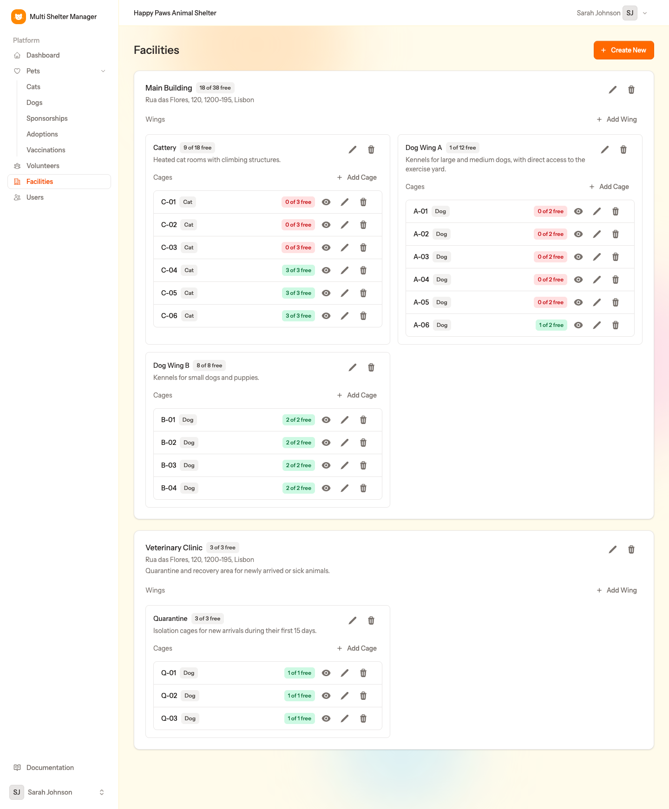
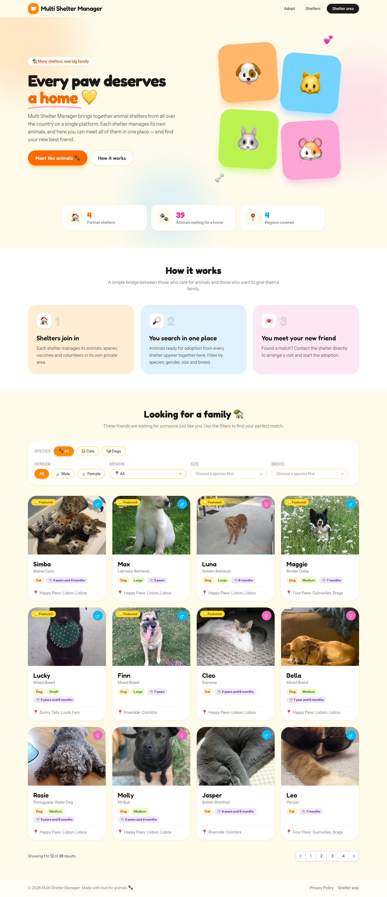

# Multi Shelter Manager

**A web application for animal shelters.** Several shelters share one platform, each completely isolated. Manage animals, cages, vaccinations, adoptions, sponsorships and volunteers, and publish your animals on a public adoption website.


## Features

- 🏠 **Multi-shelter** — any number of shelters on one installation, with strict data isolation. Users can belong to several shelters, with a different role in each.
- 👥 **Roles** — *Admin* (the platform), *Manager* (a shelter and its team) and *Staff* (daily work). Accounts are created by e-mail invitation.
- 🐾 **Pets** — identification, microchip, breed, colours, fur type, size, age, photos, health, clinical and internal notes. Status (available / not available / adopted / deceased) is worked out automatically.
- 🏢 **Facilities → Wings → Cages** — model your physical space, see occupancy at a glance and always know where every animal is.
- 💉 **Vaccinations** — given and scheduled vaccines, overdue filters and **daily e-mail reminders**.
- ❤️ **Adoptions** — adopter details, fee, application status and returns.
- 🎁 **Sponsorships** — sponsors and their one-off or recurring payments.
- 🙋 **Volunteers** — skills, preferred species, weekly availability and evaluations.
- 🖨 **Printing** — a sheet per animal and printable filtered lists.
- 🌍 **Public adoption portal** — a website listing adoptable animals from every shelter, with filters, featured animals and shelter pages. Off by default: turn it on with `PUBLIC_PORTAL_ENABLED=true` in `.env`.
- 🗣 **10 languages** — English, Portuguese, Spanish, French, German, Italian, Dutch, Polish, Swedish, Danish.
- 🌗 Light and dark mode.

| | |
|---|---|
|  |  |
|  |  |

## Quick start

Requirements: PHP 8.3+, Composer, Node.js 20+, and MySQL/MariaDB or SQLite.

```bash
git clone https://github.com/zhoorta/multi-shelter-manager.git
cd multi-shelter-manager
composer run setup          # install dependencies, create .env, migrate, build assets
php artisan storage:link    # make uploaded photos visible
composer run dev            # start the app on http://localhost:8000
```

Open http://localhost:8000. The **setup wizard** asks you to create the administrator account.

Want to explore with sample data first? Load the demo data into an **empty** database:

```bash
php artisan migrate:fresh --seeder=DocumentationDemoSeeder
```

Then log in as `admin@example.com`, `manager@example.com` or `staff@example.com` (password: `password`).

## Documentation

The full step-by-step guide, with screenshots, is in the [`docs`](docs/README.md) folder:

1. [Installation](docs/01-installation.md)
2. [First run, login and roles](docs/02-first-run-and-roles.md)
3. [Administration: shelters and lookup tables](docs/03-administration.md)
4. [Inviting users](docs/04-users-and-invitations.md)
5. [Facilities, wings and cages](docs/05-facilities.md)
6. [The dashboard](docs/06-dashboard.md)
7. [Pets](docs/07-pets.md)
8. [Vaccinations](docs/08-vaccinations.md)
9. [Adoptions](docs/09-adoptions.md)
10. [Sponsorships](docs/10-sponsorships.md)
11. [Volunteers](docs/11-volunteers.md)
12. [The public adoption portal](docs/12-public-portal.md)
13. [Personal settings](docs/13-settings.md)

## Built with

[Laravel 13](https://laravel.com) · [Livewire 4](https://livewire.laravel.com) · [Flux UI](https://fluxui.dev) · [Tailwind CSS](https://tailwindcss.com) · [Laravel Fortify](https://laravel.com/docs/fortify)

## Development

```bash
composer run test     # Pint (style) + PHPStan (static analysis) + Pest (tests)
composer run lint     # fix code style
```
