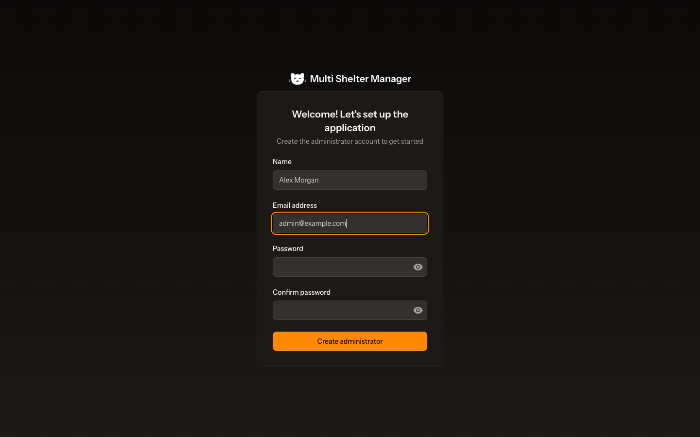
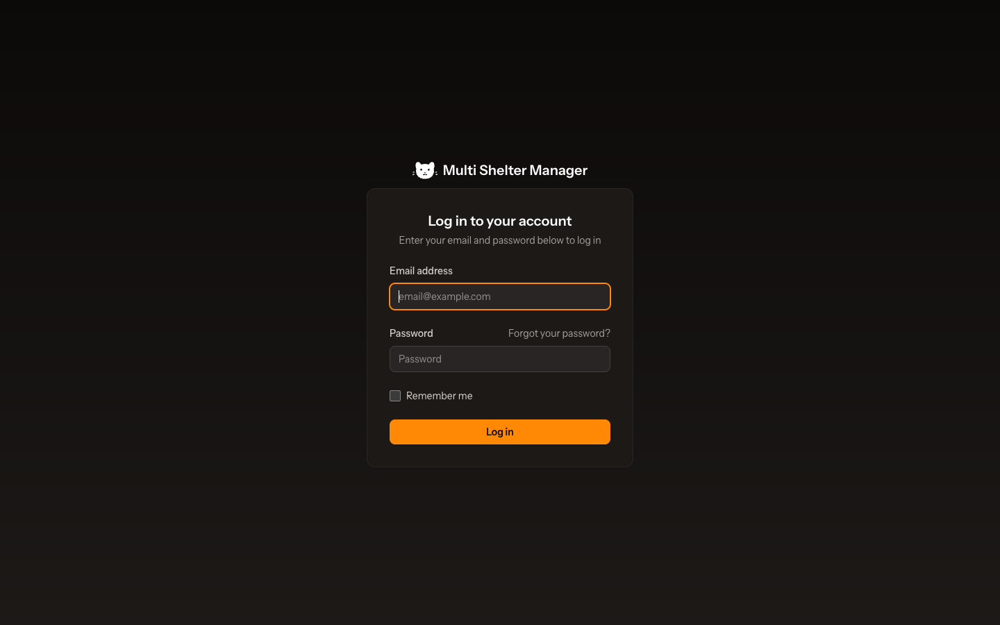
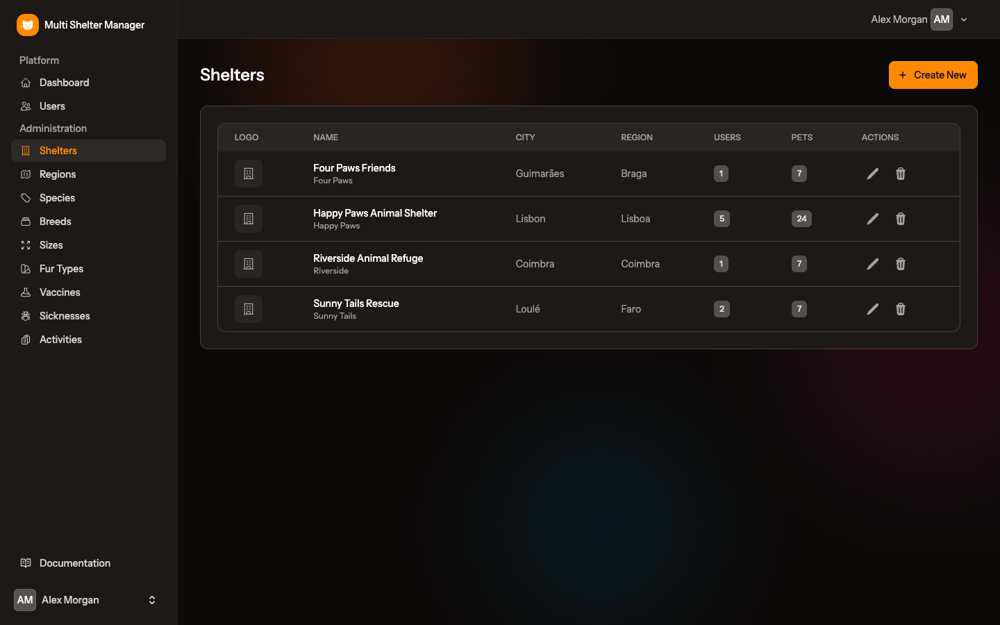

# 2. First run, login and roles

[← Installation](01-installation.md) · [Documentation index](README.md) · [Next: Administration →](03-administration.md)

## 2.1 Step 1 — Create the administrator (setup wizard)

The very first time the application is opened, there are no users yet. Every page then sends you to the **setup wizard**, which creates the first account: the platform **administrator**.

1. Enter the administrator's **Name**.
2. Enter the **Email address** that will be used to log in.
3. Choose a **Password** and type it again in **Confirm password**. Use the eye icon to show what you typed.
4. Click **Create administrator**.

You are logged in straight away and taken to the dashboard.

> The setup wizard only works while the database has no users. Once the administrator exists it is closed for good, and every other account is created **by invitation** (see [chapter 4](04-users-and-invitations.md)).

## 2.2 Logging in

From then on, everybody signs in on the login page.

1. Type your **Email address** and **Password**.
2. Tick **Remember me** to stay logged in on this device.
3. Click **Log in**.

Forgot your password? Click **Forgot your password?**, enter your e-mail address, and follow the link you receive to choose a new one.

## 2.3 Roles: who sees what

Every account has one of four roles. The role decides which menus appear in the sidebar on the left.

### Admin

The admin runs the **platform**, not the shelters. The sidebar shows **Dashboard**, **Users** and the **Administration** group:

| Menu | Purpose |
|------|---------|
| Users | Invite and manage users of every shelter, and other admins |
| Shelters | Create, edit and remove shelters |
| Regions | Regions (districts, counties, …) where shelters are located |
| Species | Kinds of animals (Dog, Cat, …) |
| Breeds | Breeds of each species |
| Sizes | Sizes available for each species |
| Fur Types | Coat types |
| Vaccines | Vaccines, per species |
| Sicknesses | Diseases, per species |
| Activities | Tasks volunteers can help with |

The admin does **not** see Pets, Volunteers, Members or Facilities. Those belong to the shelters.

### Manager

A manager runs a shelter. The sidebar shows the shelter's work plus **Users**, so they can invite their own team:

| Menu | Purpose |
|------|---------|
| Dashboard | Overview of the shelter |
| Pets → *one entry per species* (Cats, Dogs, …) | The shelter's animals |
| Pets → Sponsorships / Adoptions / Vaccinations | Lists across all the shelter's pets |
| Volunteers | People who help the shelter |
| Members | The association's members and their fees |
| Facilities | Buildings, wings and cages |
| Users | The shelter's team (manager only) |

### Staff

Staff see the same menus as a manager, **except Users**. They handle the daily work: pets, vaccinations, adoptions, sponsorships, volunteers, members and facilities.

### Viewer

A viewer has **read-only** access to a shelter. They see the same menus as staff, **except Sponsorships, Adoptions, Volunteers and Members**, and:

- can view pets, vaccinations and facilities, and print pet sheets and the pets list;
- cannot create, edit or delete anything: the **Create**, **Edit** and **Delete** buttons are hidden;
- do not see people's personal data: adopters, sponsors, volunteers and members. The adoption and sponsorship boxes are hidden on a pet's page;
- can still receive the daily vaccination reminder e-mails, if **Vaccination Notifications** is switched on for them.

## 2.4 Working with more than one shelter

A person can belong to several shelters, with a different role in each (for example Manager in one and Viewer in another). The name of the **active shelter** is shown at the top of every page. When you belong to more than one shelter, use the **shelter switcher** there to change it.

Every list, counter and form only shows the **active shelter's** data. Data is never shared between shelters.

## 2.5 The user menu

Click your name at the bottom of the sidebar (or the avatar in the top-right corner) to open the user menu:

- **Settings** — your profile, password and appearance (see [chapter 14](14-settings.md)).
- **Log out**.

---

[← Installation](01-installation.md) · [Documentation index](README.md) · [Next: Administration →](03-administration.md)
