# 3. Administration: shelters and lookup tables

[← First run, login and roles](02-first-run-and-roles.md) · [Documentation index](README.md) · [Next: Inviting users →](04-users-and-invitations.md)

> **Who:** Admin only.

Before a shelter can register its first animal, the admin prepares the platform:

1. Fill in the **lookup tables** (regions, species, breeds, sizes, fur types, vaccines, sicknesses, activities). All shelters share them.
2. Create the **shelters**.

All the pages in the **Administration** menu work the same way:

- a table lists the existing records;
- **Create New** (top right) opens a small form in a pop-up window;
- the **pencil** icon edits a record and the **bin** icon deletes it.

> **Deleting is safe.** Lookup records are *soft-deleted*: they disappear from the lists and forms, but animals that already use them keep showing the original value. Removing the "Beagle" breed, for example, does not change the pets already registered as Beagles.

## 3.1 Regions

**Administration → Regions**

Regions are the geographic areas where shelters are located (districts, counties, provinces, …). They are used to group shelters and to filter animals on the public portal.

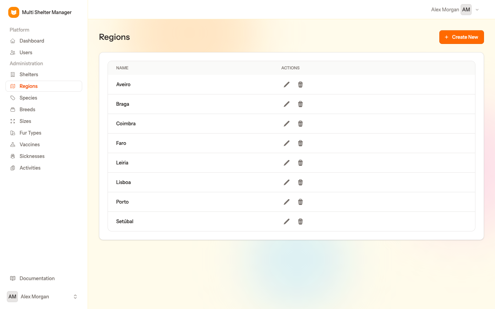

Click **Create New**, type the region's name and save.

## 3.2 Species

**Administration → Species**

Species are the kinds of animals the platform handles, such as Dog and Cat.

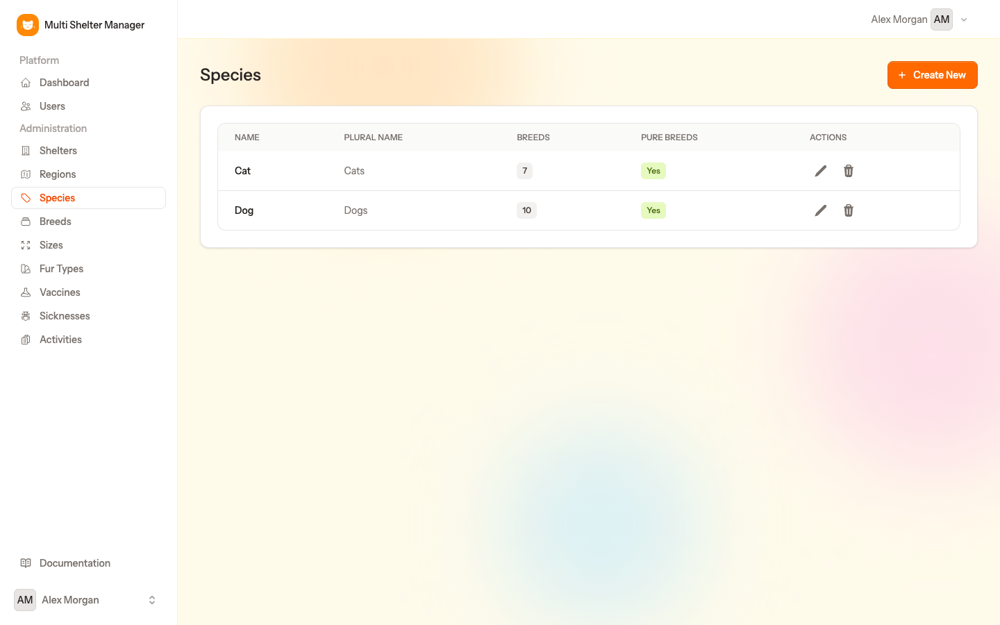

Click **Create New** to add one:

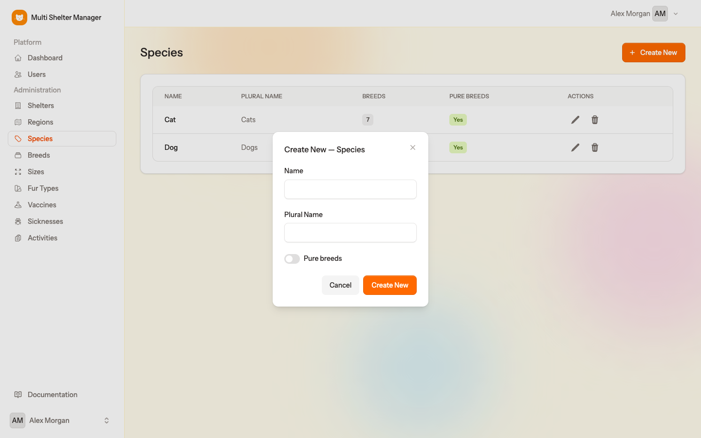

| Field | Meaning |
|-------|---------|
| Name | Singular name, e.g. *Dog* |
| Plural Name | Plural name, e.g. *Dogs*. It is the name shown in the sidebar under **Pets** |
| Pure breeds | When on, pet forms for this species show a **Pure breed** switch |

The table also shows how many breeds each species has.

## 3.3 Breeds

**Administration → Breeds**

Each breed belongs to a species. Use the **Species** filter at the top to see the breeds of one species only.

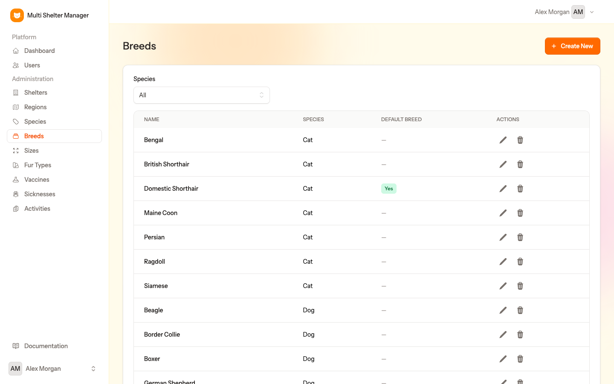

Click **Create New**, choose the **Species**, type the **Name**, and tick **Default Breed** if it should be selected automatically when a new pet of that species is registered. A good default is the "mixed" breed, such as *Mixed Breed* for dogs or *Domestic Shorthair* for cats.

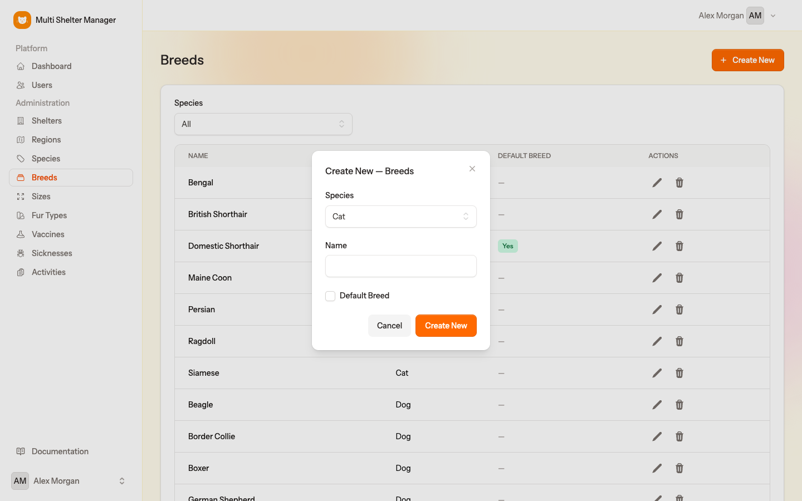

> Each species can have only one default breed.

## 3.4 Sizes

**Administration → Sizes**

Sizes also belong to a species (for example Small, Medium, Large and Giant for dogs). The **Size** field only appears on the pet form for species that have sizes. In the demo data, cats have no sizes, so cat forms don't show the field.

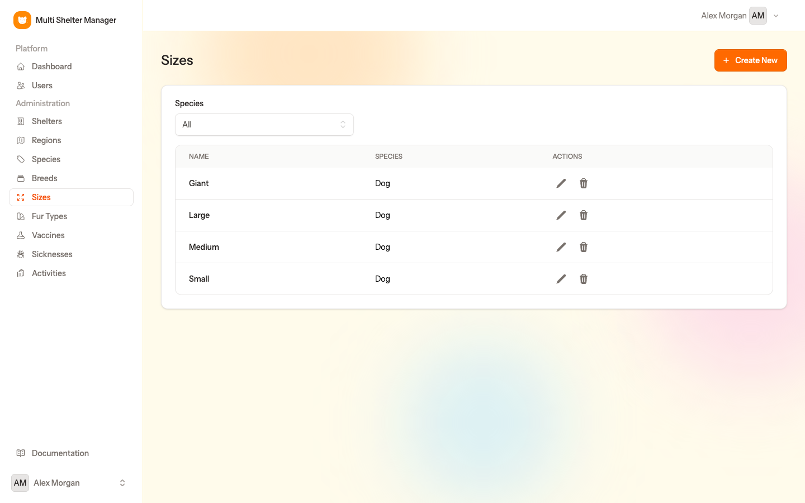

## 3.5 Fur types

**Administration → Fur Types**

Coat types shared by all species (Short, Long, Curly, Wiry, …).

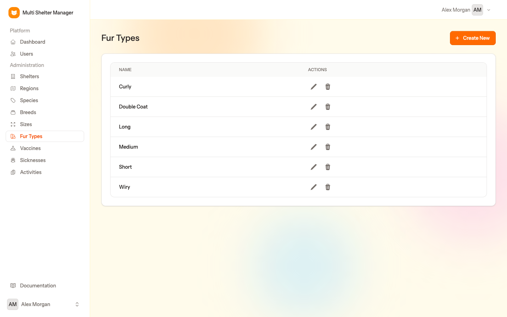

## 3.6 Vaccines

**Administration → Vaccines**

Vaccines are linked to one or more species. When you record a vaccination, only the vaccines for that pet's species are offered. Rabies, for example, applies to both dogs and cats, while FVRCP applies to cats only.

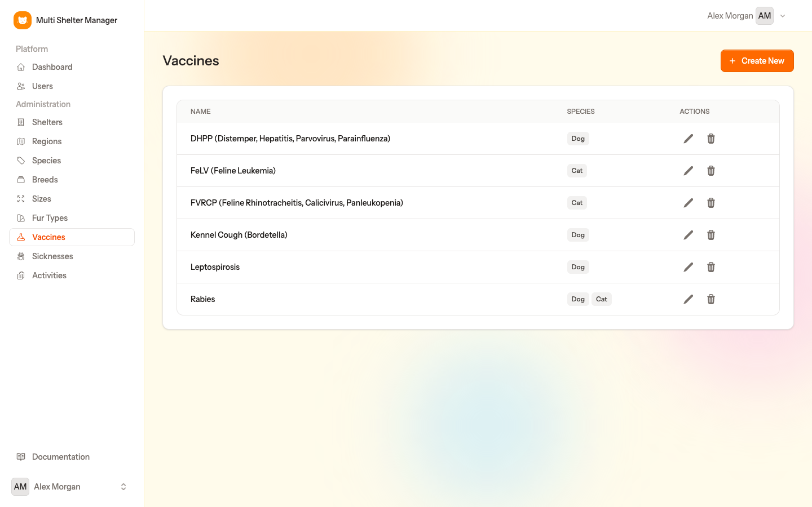

## 3.7 Sicknesses

**Administration → Sicknesses**

Diseases that can be recorded on a pet, with a description, linked to the species they affect. The sicknesses of a pet's species appear as switches in the pet's **Health** section.

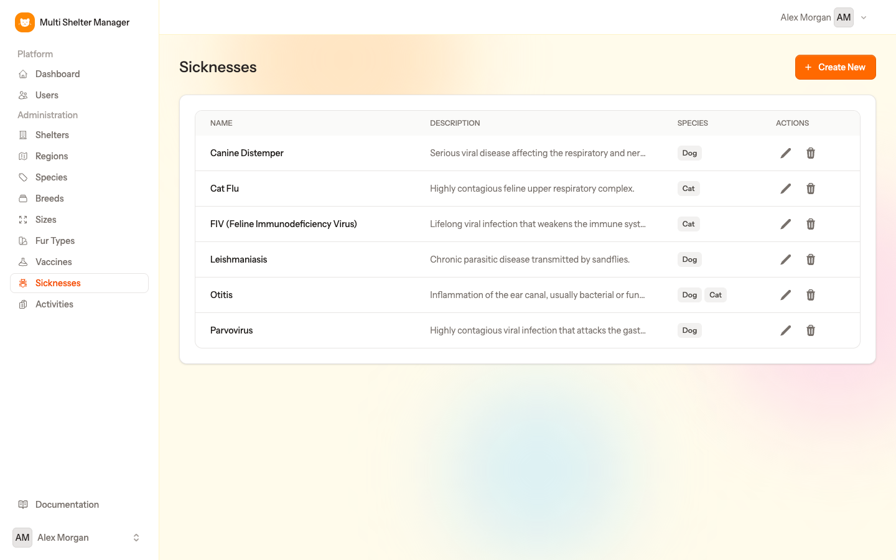

## 3.8 Activities

**Administration → Activities**

The tasks volunteers can help with: dog walking, cleaning, transport, fundraising, and so on. They are chosen on each volunteer's record (see [chapter 11](11-volunteers.md)).

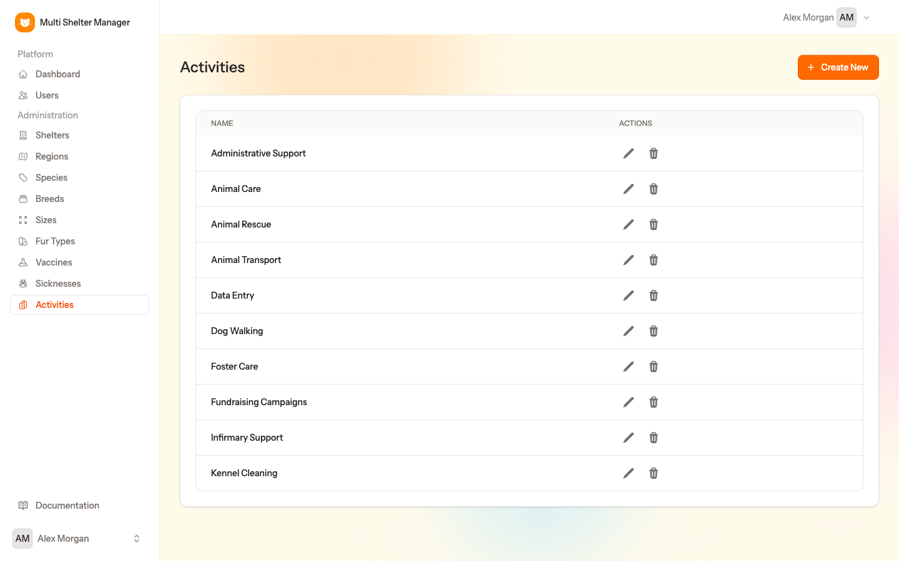

## 3.9 Shelters

**Administration → Shelters**

The list shows every shelter with its logo, city, region, and how many users and pets it has.

Click **Create New** to add a shelter, or the **pencil** icon to edit one:

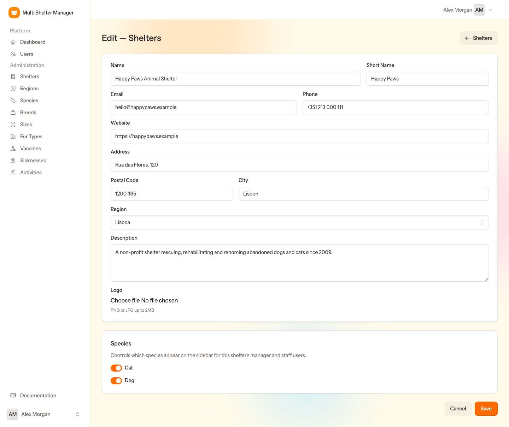

| Field | Meaning |
|-------|---------|
| Name | Full name of the shelter |
| Short Name | Short name used where space is limited (lists, cards, badges) |
| Email, Phone, Website | Public contacts, shown on printed sheets and on the public portal |
| Address, Postal Code, City | Location of the shelter |
| Region | One of the regions from section 3.1 |
| Description | Short presentation, shown on the public portal |
| Logo | PNG or JPG image up to 2 MB |
| **Species** | The species this shelter takes in. Each species switched on here gets its own entry under **Pets** in the sidebar of the shelter's managers and staff |

Click **Save**.

## 3.10 Next step

With the lookup tables filled in and the shelters created, invite each shelter's manager. See [Inviting users](04-users-and-invitations.md).

---

[← First run, login and roles](02-first-run-and-roles.md) · [Documentation index](README.md) · [Next: Inviting users →](04-users-and-invitations.md)
