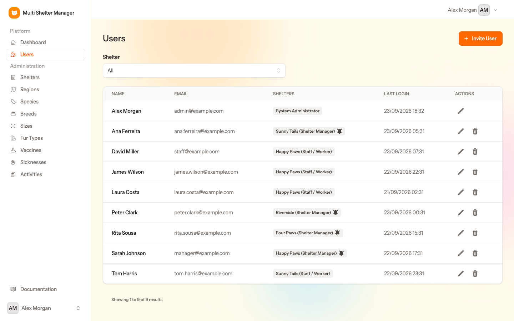
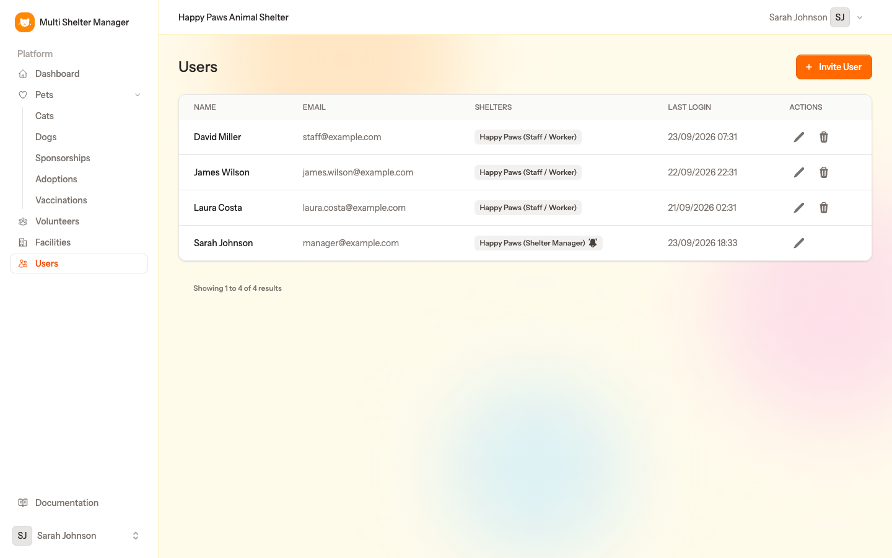
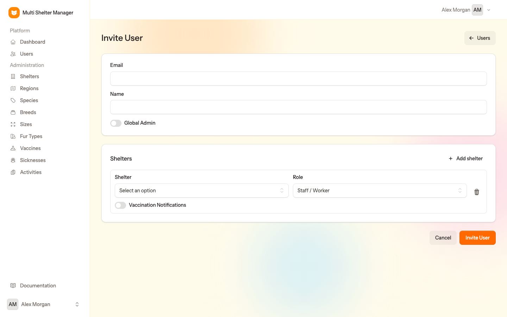
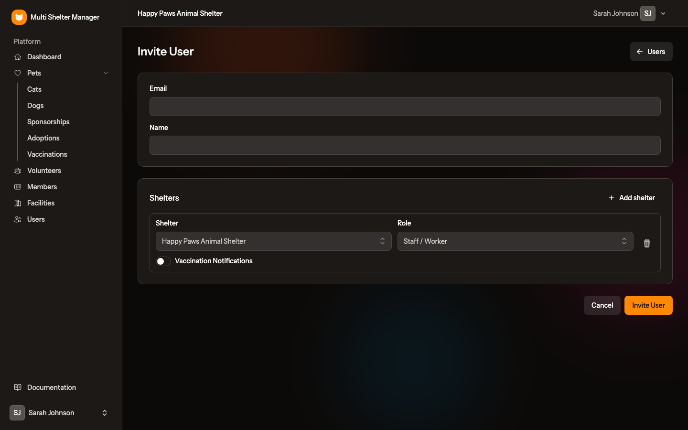

# 4. Inviting users

[← Administration](03-administration.md) · [Documentation index](README.md) · [Next: Facilities, wings and cages →](05-facilities.md)

> **Who:** Admin (any shelter) and Manager (only the shelters they manage).

Nobody can sign up on their own. Every account after the first administrator is created **by invitation**.

## 4.1 The users list

Open **Users** in the sidebar.

**As admin**, you see every user on the platform. Use the **Shelter** filter to narrow the list to one shelter:

**As a manager**, you only see the users of your shelter:

For each user the list shows:

- **Name** and **Email**;
- **Shelters** — each shelter the user belongs to, with their role there (*Shelter Manager*, *Staff / Worker* or *Viewer (read-only)*). Admins show *System Administrator*;
- the 🔔 **bell icon** — this user receives the daily vaccination reminder e-mails for that shelter;
- **Last Login** — when the user last signed in;
- **Actions** — edit (pencil) or remove (bin).

## 4.2 Step by step: invite a user

1. Go to **Users** and click **Invite User**.
2. Fill in the **Email** and the **Name** of the person.
3. In the **Shelters** section, choose the **Shelter** and the **Role**:
   - **Shelter Manager** — can do everything in that shelter, including inviting users;
   - **Staff / Worker** — can do the daily work, but cannot manage users;
   - **Viewer (read-only)** — can see the shelter's pets, vaccinations and facilities and print pet sheets, but cannot change anything or see people's personal data (adopters, sponsors, volunteers and members).
4. Switch on **Vaccination Notifications** if this person should receive the daily e-mail about vaccinations due soon (see [chapter 8](08-vaccinations.md)).
5. To give the person access to **more shelters**, click **Add shelter** and repeat step 3. The bin icon removes a row.
6. Click **Invite User**.

Admin view (the **Global Admin** switch is only available to admins):

Manager view (the shelter is already set to the manager's shelter):

## 4.3 What happens next

The invited person receives an e-mail titled *"You've Been Invited to Multi Shelter Manager platform"*. It shows the shelter and role and has a **Create Password** button.

1. They click **Create Password**.
2. They choose their password.
3. They are logged in and can start working.

The invitation link is valid for **48 hours**. If it expires, the person can use **Forgot your password?** on the login page to get a new link.

> **Already has an account?** If you invite an e-mail that already belongs to a user, no new account is created. The existing user is added to the new shelter and receives an e-mail saying so. They can then pick that shelter with the shelter switcher at the top of the page.

## 4.4 Creating another administrator

Only admins can do this. In **Invite User**, switch on **Global Admin**. Administrators are not tied to any shelter, so the **Shelters** section is not needed.

## 4.5 Editing and removing users

- **Pencil** — change the user's name, their shelters and roles, and their vaccination notifications. A user's e-mail address cannot be changed.
- **Bin** — removes the user. They can no longer log in.

Managers can only change memberships of the shelters they manage.

---

[← Administration](03-administration.md) · [Documentation index](README.md) · [Next: Facilities, wings and cages →](05-facilities.md)
