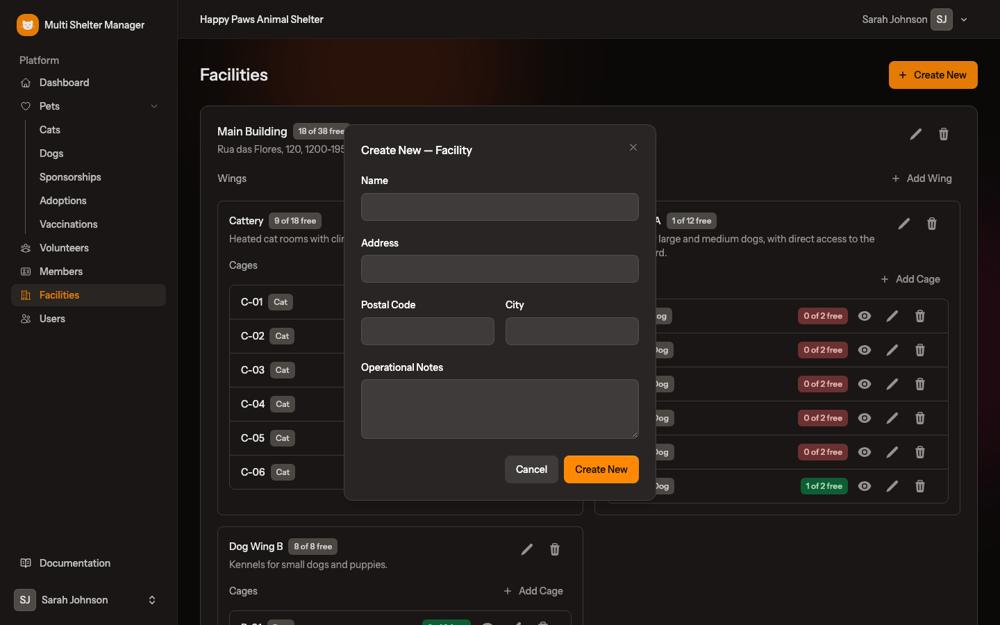
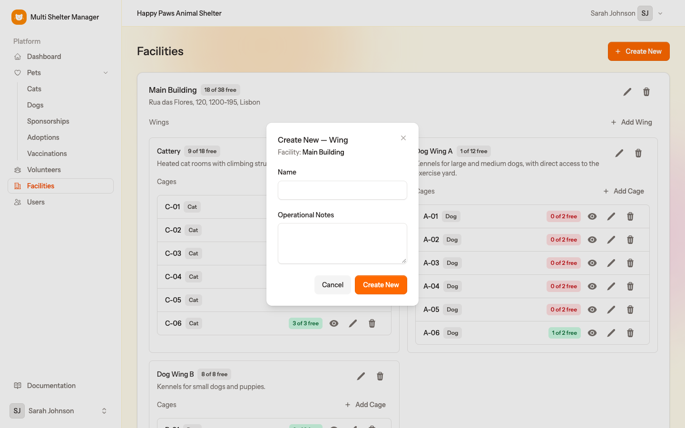
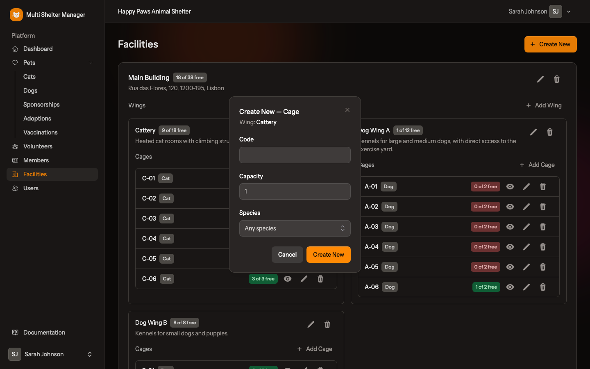
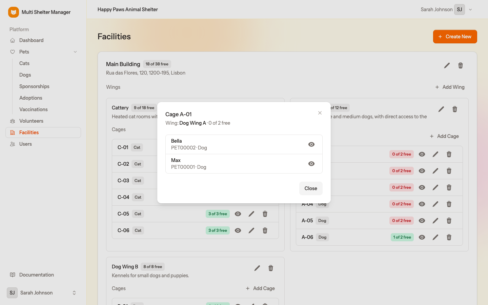

# 5. Facilities, wings and cages

[← Inviting users](04-users-and-invitations.md) · [Documentation index](README.md) · [Next: The dashboard →](06-dashboard.md)

> **Who:** Manager and Staff. Viewers can open these pages but cannot change anything.

Before you register animals, describe where they will live. A shelter's space is organised in three levels:

```
Facility   (a physical site with an address, e.g. "Main Building")
 └── Wing  (an area inside it, e.g. "Dog Wing A", "Cattery")
      └── Cage  (where the animals are placed, with a code and a capacity)
```

The **total capacity of all cages** is the number of animals the shelter can house. It feeds the *Available Capacity* counter on the dashboard.

## 5.1 The Facilities page

Open **Facilities** in the sidebar. Each facility is a large card holding its wings, and each wing lists its cages.


The badges show how full each level is, for example **18 of 38 free**. Each cage's badge is coloured by occupancy:

| Colour | Meaning |
|--------|---------|
| 🟢 Green | Plenty of room |
| 🟡 Yellow | More than 80% full |
| 🔴 Red | Full: no free places |

Each cage row also shows the **species** it is meant for (*Dog*, *Cat*), and three icons:

- 👁 **eye** — see the animals in the cage;
- ✏️ **pencil** — edit the cage;
- 🗑 **bin** — delete the cage.

## 5.2 Step 1 — Create a facility

1. Click **Create New** (top right).
2. Fill in the **Name** (e.g. *Main Building*), and optionally the **Address**, **Postal Code**, **City** and **Operational Notes**.
3. Click **Create New**.



## 5.3 Step 2 — Add wings to the facility

1. On the facility's card, click **Add Wing**.
2. Type the wing's **Name** (e.g. *Dog Wing A*) and optional **Operational Notes**, such as what the wing is used for.
3. Click **Create New**.



## 5.4 Step 3 — Add cages to the wing

1. On the wing, click **Add Cage**.
2. Fill in:
   - **Code** — a short label for the cage, e.g. *A-01*;
   - **Capacity** — how many animals fit in it;
   - **Species** — the species this cage is for, or *Any species*. When a pet is placed, only cages for its species (or for any species) are offered.
3. Click **Create New**.



Repeat for every cage in the wing.

## 5.5 Who is in this cage?

Click the **eye** icon on a cage to list the animals in it. The eye icon next to each animal opens its record.



## 5.6 Editing and deleting

- Use the **pencil** icons to rename a facility, wing or cage, or to change a cage's capacity or species.
- Use the **bin** icons to delete them. Deleting a facility also deletes its wings and cages, and deleting a wing also deletes its cages.

> Animals are placed in cages from the pet form (**Cage** field), not from this page. See [Pets](07-pets.md).

---

[← Inviting users](04-users-and-invitations.md) · [Documentation index](README.md) · [Next: The dashboard →](06-dashboard.md)
