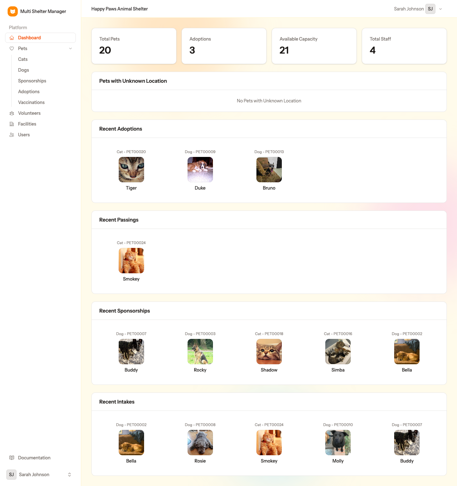

# 6. The dashboard

[← Facilities, wings and cages](05-facilities.md) · [Documentation index](README.md) · [Next: Pets →](07-pets.md)

> **Who:** Manager, Staff and Viewer.

The dashboard is the first page you see after logging in. It gives you a summary of the **active shelter**, whose name is shown at the top.

## 6.1 Counters

| Counter | Meaning |
|---------|---------|
| **Total Pets** | Animals currently in the shelter (not adopted and not deceased) |
| **Adoptions** | Animals adopted |
| **Available Capacity** | Free places left in the cages |
| **Total Staff** | Users who belong to the shelter |

## 6.2 Panels

| Panel | What it shows |
|-------|---------------|
| **Pets with Unknown Location** | Animals in the shelter that have no cage yet. Open them and set a cage so the team always knows where every animal is |
| **Recent Adoptions** | The latest animals to be adopted |
| **Recent Passings** | The latest animals that have died |
| **Recent Sponsorships** | The latest animals to get a sponsor |
| **Recent Intakes** | The latest animals to arrive (by check-in date) |

Each animal is shown with its photo, species and reference. Click it to open its record.

## 6.3 Warnings

When something important is still missing, the dashboard shows a warning to help you finish the setup. For example:

- no cages have been created yet, so animals cannot be given a location;
- a species has no breeds, so its animals cannot be registered properly (ask the admin to add them).

---

[← Facilities, wings and cages](05-facilities.md) · [Documentation index](README.md) · [Next: Pets →](07-pets.md)
