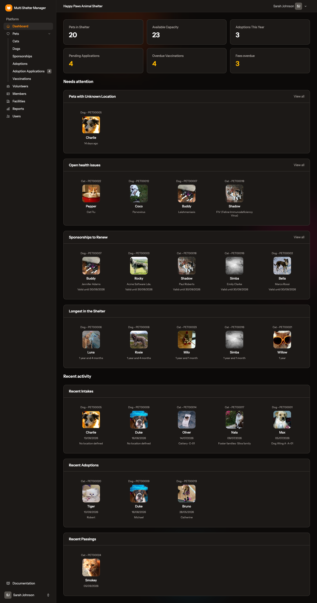
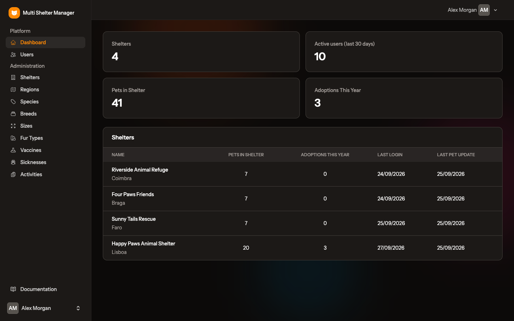

# 6. The dashboard

[← Facilities, wings and cages](05-facilities.md) · [Documentation index](README.md) · [Next: Pets →](07-pets.md)

> **Who:** Manager, Staff and Viewer. Admins get a platform overview instead ([6.5](#65-the-admin-dashboard)).

The dashboard is the first page you see after logging in. It gives you a summary of the **active shelter**, whose name is shown at the top.

## 6.1 Counters

| Counter | Meaning |
|---------|---------|
| **Pets in Shelter** | Animals currently in the shelter's care (not adopted and not deceased), including those with foster families |
| **Available Capacity** | Free places left in the shelter's cages. Foster family wings are not counted, and neither are the animals living with foster families |
| **Adoptions This Year** | Adoptions this calendar year that were not returned |

Managers and staff also see three counters that call for action. Each one opens the list it counts, and turns amber when it is above zero:

| Counter | Opens |
|---------|-------|
| **Pending Applications** | Adoption applications waiting for a decision ([9.5](09-adoptions.md#95-adoption-applications)) |
| **Overdue Vaccinations** | Scheduled vaccinations past their due date ([chapter 8](08-vaccinations.md)) |
| **Fees overdue** | Members with an unpaid joining fee or no membership fee covering today ([12.5](12-members.md#125-fees-overdue)) |

## 6.2 Needs attention

Short lists of animals that need something done. Each list shows up to five animals and **only appears when it has any**. **View all** opens the pets list with the matching filter already applied.

| List | What it shows |
|------|---------------|
| **Pets with Unknown Location** | Animals in the shelter that have no cage yet, and for how long (*12 days ago*). Open them and set a cage so the team always knows where every animal is |
| **Open health issues** | Animals with an active or chronic diagnosis, the most recent diagnosis first, with the diagnoses under the name ([diagnoses](07-pets.md#diagnoses)) |
| **Sponsorships to Renew** | Sponsorships whose paid period ended in the last 30 days or ends in the next 30, with the sponsor's name and *Valid until* / *Expired at*. Click one to open the sponsorship and contact the sponsor. Managers and staff only |
| **Pets without a Photo** | Animals in the shelter with no photo. Without one they can't be shown well on the public portal or shared on social media |
| **Longest in the Shelter** | The available animals that have waited longest since check-in, with how long (*1 year and 4 months*): good candidates to promote |

## 6.3 Recent activity

| List | Details under each animal |
|------|---------------------------|
| **Recent Intakes** | Check-in date and cage (*wing · cage*), or *No location defined* |
| **Recent Adoptions** | Adoption date and the adopter's first name (viewers don't see the name) |
| **Recent Passings** | Date of death |

These lists always show, with a short message when they are empty. Each animal is shown with its photo, species and reference. Click it to open its record.

## 6.4 Warnings

When something important is still missing, the dashboard shows a warning to help you finish the setup. For example:

- no cages have been created yet, so animals cannot be given a location;
- a species has no breeds, so its animals cannot be registered properly (ask the admin to add them).

## 6.5 The admin dashboard

Admins don't belong to a shelter, so their dashboard shows the **whole platform** instead. It shows totals only, never animals or people's details.

- **Counters**: shelters, users who logged in during the last 30 days, animals in care and adoptions this year, across all shelters.
- **Shelters**: each shelter with its animals in care, adoptions this year, the **last login** of any of its users and the **last pet update**. The least recently used shelters come first, and a last login that is *Never* or older than 30 days is highlighted, so shelters that went quiet stand out. Click a name to edit the shelter.
- **Setup to complete** (only when there is something to fix): shelters with no species enabled, no cages or no users, and species used by a shelter that have no breeds.
- **Invitations not accepted** (only when there are any): invited users who have never logged in, with their email, shelter and invitation date.

---

[← Facilities, wings and cages](05-facilities.md) · [Documentation index](README.md) · [Next: Pets →](07-pets.md)
