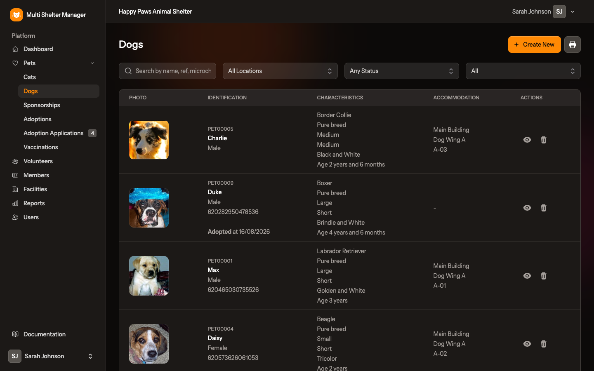
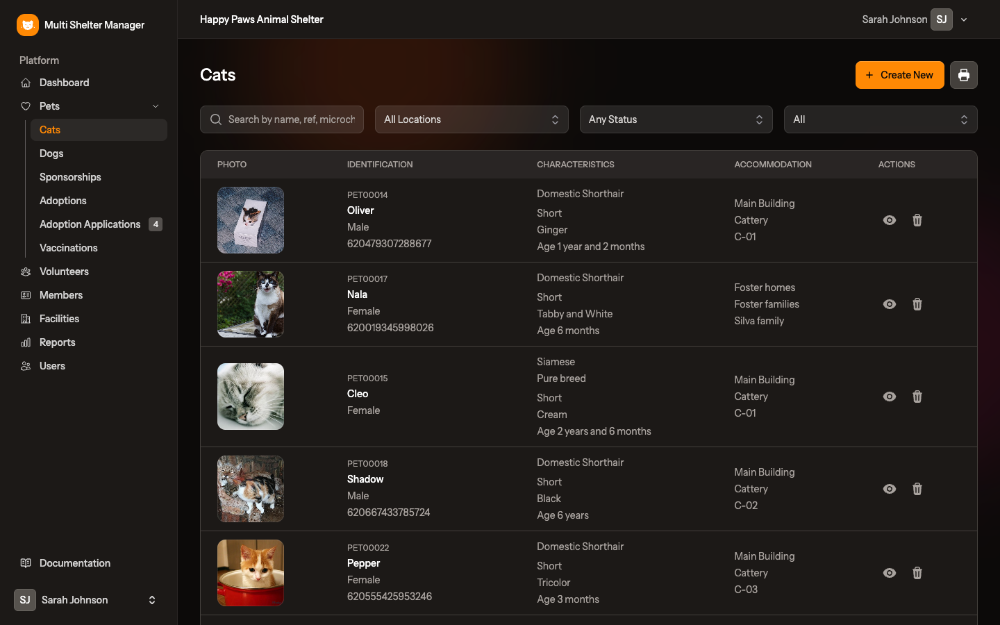
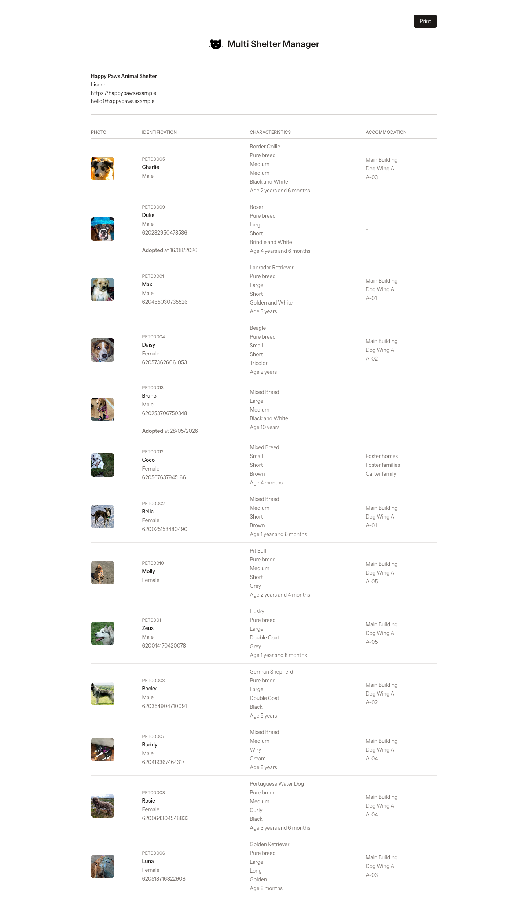
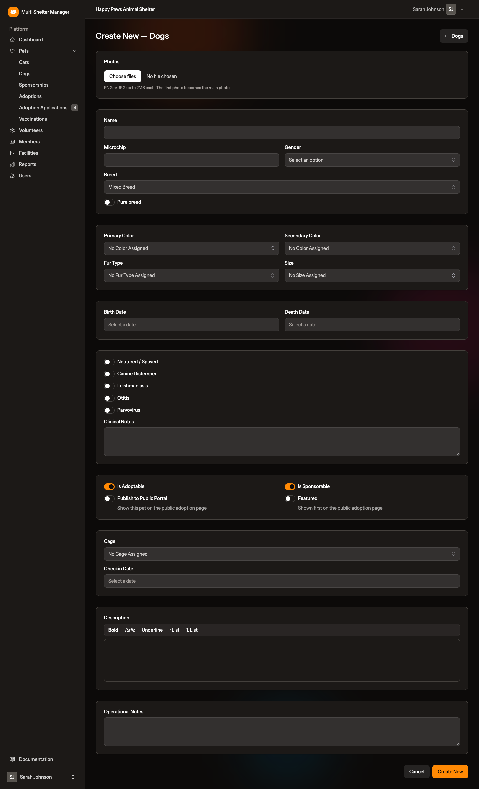
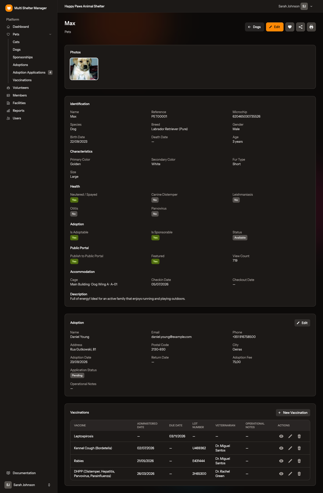
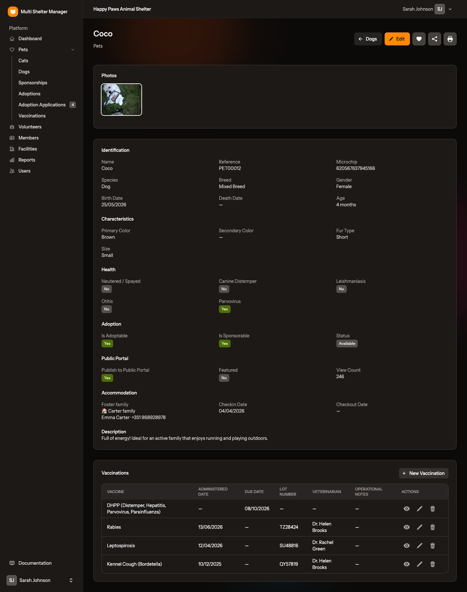
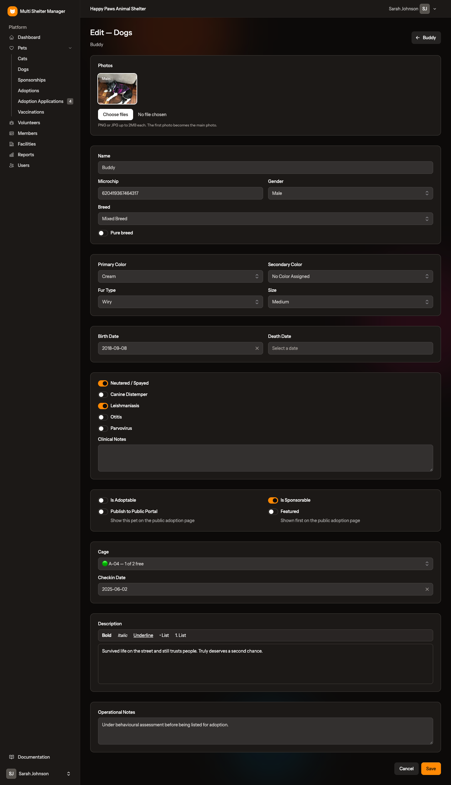
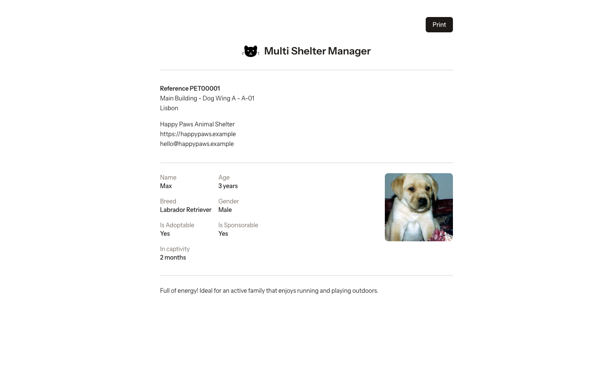
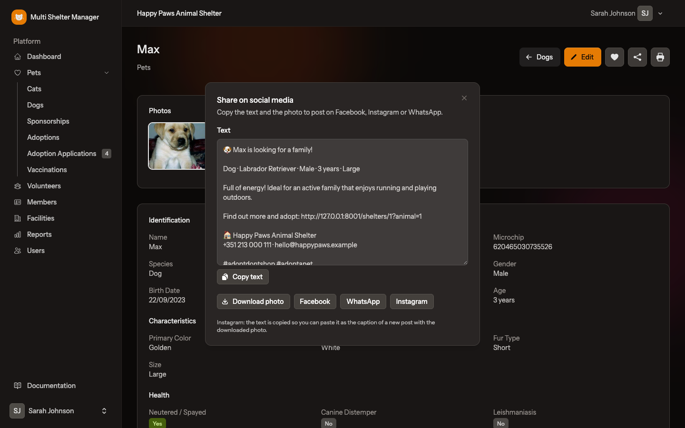

# 7. Pets

[← The dashboard](06-dashboard.md) · [Documentation index](README.md) · [Next: Vaccinations →](08-vaccinations.md)

> **Who:** Manager and Staff. Viewers can open these pages but cannot change anything.

Pets are at the heart of the application. Each animal has one record holding its identification, physical description, health, photos, location, adoption and sponsorship history, and vaccinations.

## 7.1 The pet list

The sidebar has one entry under **Pets** for each species the shelter takes in, for example **Cats** and **Dogs**. Click one to open the list for that species.

Each row shows:

| Column | Content |
|--------|---------|
| **Photo** | The pet's main photo |
| **Identification** | Reference (e.g. *PET00002*), name, gender and microchip. Adopted animals also show *Adopted at* and the date |
| **Characteristics** | Breed (and *Pure breed*), size, fur type, colours and age |
| **Accommodation** | Facility, wing and cage, or *–* if the animal has no location |
| **Actions** | 👁 open the record · 🗑 delete |

### Searching and filtering

The bar above the table has four controls:

1. **Search**: type part of a name, reference, microchip number or internal note.
2. **Location**: show only animals in one facility, wing or cage.
3. **Status**: *Available*, *Not available*, *Adopted* or *Deceased*.
4. **Missing data**: find incomplete records, meaning animals with **no age** (no birth date), **no photo**, **no check-in date** or **no location**. Use it regularly to keep records complete.

### Printing the list

The 🖨 **printer** button next to **Create New** opens a printable version of the list. It uses the filters currently active on screen. Click **Print** on that page to send it to the printer or save it as PDF.

## 7.2 Step by step: register a new pet

1. Open the species list (e.g. **Pets → Dogs**) and click **Create New**.
2. Fill in the form, card by card:

**Photos**

- Click **Choose files** to upload one or more PNG or JPG photos (up to 2 MB each). The first photo becomes the **main photo**, which is used in lists, the dashboard and the public portal.

**Identification**

- **Name** — the animal's name (required).
- **Microchip** — the chip number, if it has one.
- **Gender** — Male or Female.
- **Breed** — already set to the species' default breed; change it if you know the breed.
- **Pure breed** — only for species where the admin enabled pure breeds.

**Physical description**

- **Primary Color** and **Secondary Color**.
- **Fur Type**.
- **Size** — only for species that have sizes (see [Administration → Sizes](03-administration.md#34-sizes)).

**Dates**

- **Birth Date** — used to work out the age shown everywhere (e.g. *2 years and 6 months*). An estimate is fine.
- **Death Date** — leave empty. Fill it in only if the animal dies.

**Health**

- **Neutered / Spayed**.
- A switch for each **sickness** of the species (e.g. Leishmaniasis, Parvovirus). Switch one on when the animal is diagnosed; the diagnosis date is recorded automatically.
- **Clinical Notes** — medication, diets, allergies, vet observations.

**Adoption and public portal**

- **Is Adoptable** — the animal can be adopted. When off, its status is *Not available* (for example during quarantine or a behavioural assessment).
- **Is Sponsorable** — the animal can receive sponsors.
- **Publish to Public Portal** — show this animal on the public adoption website.
- **Featured** — show it first on the public adoption website, with a *Featured* badge.

**Accommodation**

- **Cage** — where the animal is housed. The list is grouped by facility and wing, shows the free places in each cage (green, yellow or red), and only offers cages for this species or for any species. To place the animal with a foster family, choose that family's cage in the foster families wing (see [5.7](05-facilities.md#57-foster-families)).
- **Checkin Date** — the day the animal arrived at the shelter.

**Texts**

- **Description** — a friendly public text about the animal's personality. It is shown on the public portal and the printed sheet, and supports **bold**, *italic*, underline and lists.
- **Operational Notes** — internal notes for the team only.

3. Click **Create New**.

The pet gets an automatic **reference** such as `PET00025`. Use it to find the animal quickly.

## 7.3 The pet record

Click the 👁 icon in a list (or a pet anywhere else) to open its record.

The record shows, in sections:

- **Photos**.
- **Identification** — name, microchip, species, breed, gender, birth date, death date.
- **Characteristics** — colours, fur type, size.
- **Health** — neutered/spayed and each sickness (Yes/No).
- **Adoption** — *Is Adoptable*, *Is Sponsorable* and the current **Status**.
- **Public Portal** — whether it is published or featured, and the **View Count** (how many times its page was viewed on the portal).
- **Accommodation** — cage (facility · wing · cage), check-in and check-out dates.
- **Description**.
- The **adoption** (if any), with its own **Edit** button — see [chapter 9](09-adoptions.md).
- **Vaccinations**, with a **New Vaccination** button — see [chapter 8](08-vaccinations.md).

The buttons at the top right are:

| Button | Action |
|--------|--------|
| ← *Species* | Back to the list |
| ✏️ **Edit** | Open the edit form |
| ❤️ **Heart** | Menu with **Adoption Registration** (hidden once the pet is adopted) and **Sponsorship Registration** (only if the pet is sponsorable) |
| 🖨 **Printer** | Print the pet's sheet |
| 🔗 **Share** | Prepare a social media post (only for adoptable, available pets) — see [7.9](#79-sharing-on-social-media) |

When the animal is with a foster family, **Accommodation** shows **Foster family** with the family's name and, for managers and staff, the contact's name and phone:

## 7.4 Status is automatic

You never set a pet's status by hand. It is worked out from the record:

| Status | When |
|--------|------|
| **Deceased** | A **Death Date** is filled in |
| **Adopted** | The pet has an adoption with no **Return Date** |
| **Available** | Otherwise, when **Is Adoptable** is on |
| **Not available** | Otherwise, when **Is Adoptable** is off |

## 7.5 Editing a pet

Click **Edit** on the record. The form is the same as the one used to create the pet, filled with the current values.

In the **Photos** card you can add more photos, choose which one is the main photo, or delete photos.

Click **Save** when you are done.

## 7.6 Printing a pet's sheet

The 🖨 button on the record opens a one-page sheet with the shelter's contacts, the pet's reference and location, name, age, breed, gender, whether it is adoptable and sponsorable, how long it has been in the shelter (*In captivity*), its photo and its description. It is handy for kennel doors or adoption fairs.

## 7.7 When a pet dies

Edit the pet and fill in the **Death Date**. The pet's status becomes *Deceased*, it leaves the shelter's counters and appears under **Recent Passings** on the dashboard.

## 7.8 Deleting a pet

The 🗑 icon in the list deletes a pet. Only use it for records created by mistake. For animals that were adopted or died, keep the record so the history is preserved.

## 7.9 Sharing on social media

Pets that are **adoptable and available** have a 🔗 **Share** button at the top of their record. It opens a panel with everything needed to post the pet on Facebook, Instagram or WhatsApp:

- a ready-made **text** with the pet's name, species, breed, gender, age and size, the start of its description, the shelter's name and contacts, and a few hashtags. Click **Copy text** to copy it;
- **Download photo**, to save the pet's main photo and attach it to the post;
- **WhatsApp**, to send the text straight away;
- **Instagram** (when the pet has a photo). Instagram does not accept ready-made posts from a link, so the button copies the text and opens Instagram, where you create a post with the downloaded photo and paste the text as the caption;
- when the [public portal](14-public-portal.md) is on and the pet is published there, the text also includes a **link to the pet**, and a **Facebook** button shares that link directly.

If the portal is on but the pet is not published yet, the panel reminds you to switch on **Publish to Portal** so the text can include the link.

---

[← The dashboard](06-dashboard.md) · [Documentation index](README.md) · [Next: Vaccinations →](08-vaccinations.md)
