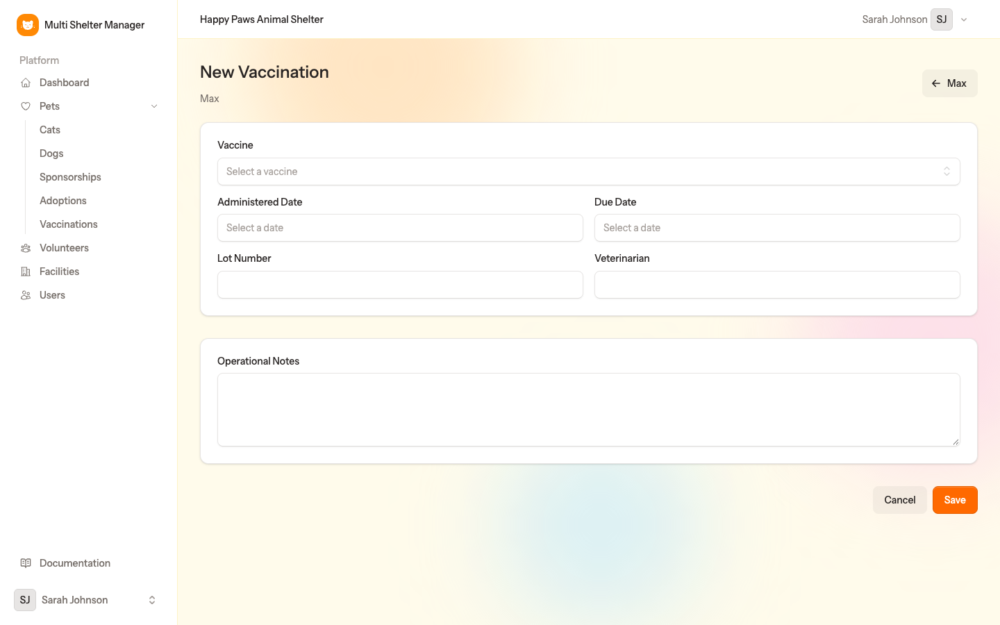
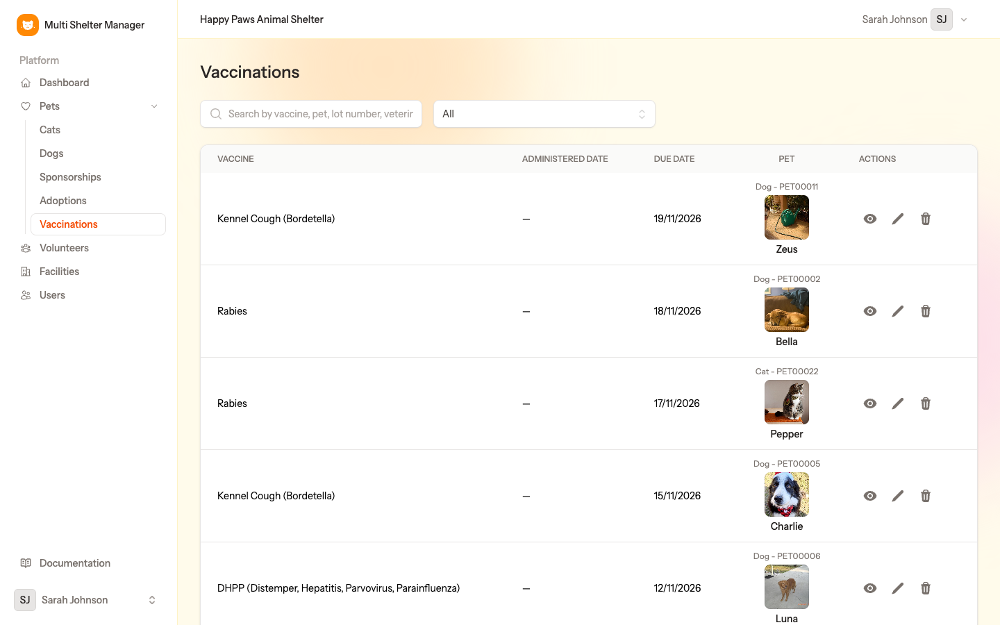

# 8. Vaccinations

[← Pets](07-pets.md) · [Documentation index](README.md) · [Next: Adoptions →](09-adoptions.md)

> **Who:** Manager and Staff.

Record every vaccine given to a pet and every vaccine that is due, so nothing is forgotten. The application can also e-mail the team every day about vaccinations due soon.

## 8.1 Step by step: record a vaccination

1. Open the pet's record (see [Pets](07-pets.md)).
2. Scroll down to the **Vaccinations** section and click **New Vaccination**.
3. Fill in the form:

| Field | Meaning |
|-------|---------|
| **Vaccine** | Only the vaccines for this pet's species are listed |
| **Administered Date** | The day the vaccine was given. Leave it empty for a vaccination that is still to be given |
| **Due Date** | When the vaccine is due (for a scheduled vaccination or the next booster) |
| **Lot Number** | The vaccine batch number, from the label |
| **Veterinarian** | Who gave the vaccine |
| **Operational Notes** | Anything else worth recording |

4. Click **Save**.

A vaccination **with** an administered date counts as *given*. One **without** it counts as *scheduled*, and it is the scheduled ones that trigger reminders.

**Typical workflow:** when the vet gives a vaccine, record it with the **Administered Date**. Then record the next booster as a new vaccination with only its **Due Date**. When the booster is given, edit that record and fill in its **Administered Date**.

The pet's record lists all its vaccinations, with 👁 view, ✏️ edit and 🗑 delete icons:

## 8.2 The Vaccinations page

**Pets → Vaccinations** lists the vaccinations of **all** the shelter's pets, with the vaccine, administered date, due date and the pet's photo and reference.

- **Search** by vaccine, pet, lot number or veterinarian.
- **Filter** by due date:
  - *Due date within a week*
  - *Due date within two weeks*
  - *Due date within a month*
  - *Vaccine overdue* — the due date has passed and the vaccine was not given.

Use *Vaccine overdue* and *Due date within a week* to plan the vet's visits.

## 8.3 Daily e-mail reminders

Every day, the application sends an e-mail to the users who have **Vaccination Notifications** switched on for a shelter. The e-mail lists that shelter's vaccinations that are **due in the next 7 days** and have not been given yet.

- Each vaccination is included in a reminder **only once**, so nobody gets the same alert every day.
- Switch notifications on or off per user and per shelter in **Users → Edit** (see [chapter 4](04-users-and-invitations.md)).
- In the users list, a 🔔 bell next to a shelter shows who receives the reminders.

> The reminders need the scheduler to be running on the server and a working mail configuration. See [Installation, section 1.8](01-installation.md#18-schedule-the-daily-tasks).

---

[← Pets](07-pets.md) · [Documentation index](README.md) · [Next: Adoptions →](09-adoptions.md)
