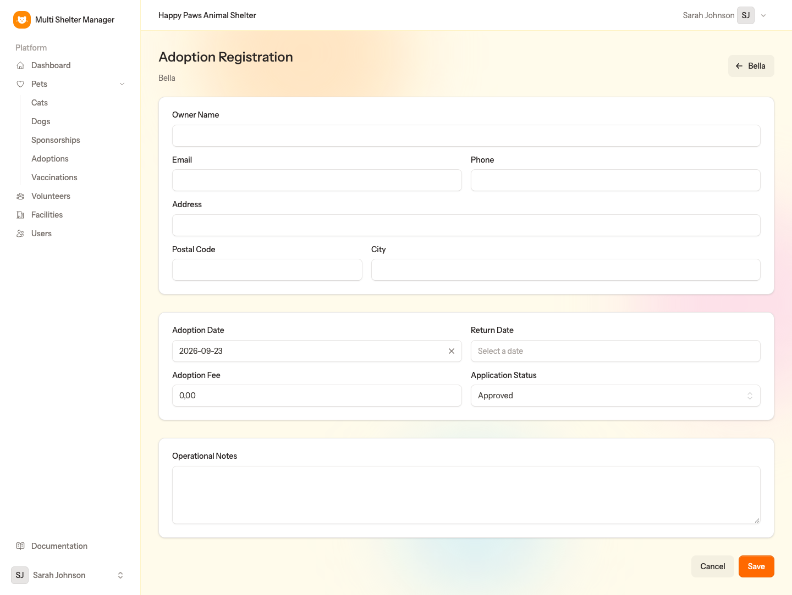
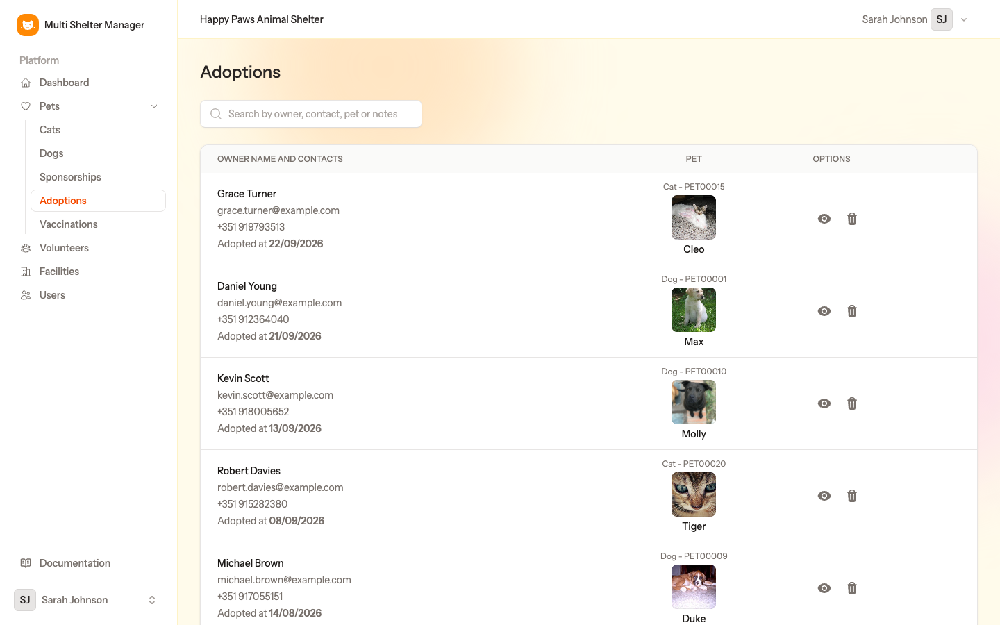
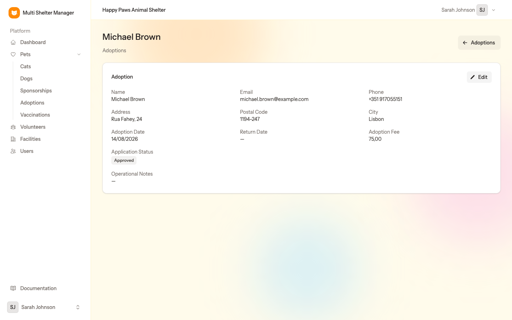

# 9. Adoptions

[← Vaccinations](08-vaccinations.md) · [Documentation index](README.md) · [Next: Sponsorships →](10-sponsorships.md)

> **Who:** Manager and Staff.

An adoption records who adopted an animal, when, and for what fee. It also records the application's progress: *Pending*, *Approved* or *Rejected*.

## 9.1 Step by step: register an adoption

1. Open the pet's record.
2. Click the ❤️ **heart** button (top right) and choose **Adoption Registration**.
3. Fill in the form:

**Adopter**

- **Owner Name** — the adopter's full name.
- **Email**, **Phone**, **Address**, **Postal Code**, **City**.

**Adoption**

- **Adoption Date** — today's date is filled in for you.
- **Return Date** — leave empty. Fill it in only if the animal is returned (see 9.4).
- **Adoption Fee** — the amount paid.
- **Application Status**:
  - **Pending** — the application is still being assessed (home visit, interview, …);
  - **Approved** — the adoption is confirmed;
  - **Rejected** — the application was refused.

**Operational Notes** — internal notes, such as how the home visit went.

4. Click **Save**.

## 9.2 What changes on the pet

As soon as a pet has an adoption with no **Return Date**, its status becomes **Adopted**, whatever the application status. Register the adoption when it is actually happening, and keep the details of applications still under assessment in your notes. From then on:

- it leaves *Total Pets* and appears in *Recent Adoptions* on the dashboard;
- the pet list shows *Adopted at* and the date;
- it no longer appears on the public adoption portal;
- the **Adoption Registration** option disappears from the heart menu.

The adoption is shown on the pet's record, with an **Edit** button.

## 9.3 The Adoptions page

**Pets → Adoptions** lists every adoption of the shelter, newest first. Each row shows the adopter's name and contacts, the adoption date and the pet.

- **Search** by adopter, contact, pet or notes.
- 👁 opens the adoption, 🗑 deletes it.

The adoption page shows all its details, with an **Edit** button:

## 9.4 When an animal is returned

Sometimes an adopted animal comes back to the shelter. **Do not delete the adoption.** Instead:

1. Open the adoption (from the pet's record or from **Pets → Adoptions**) and click **Edit**.
2. Fill in the **Return Date**, and explain why in **Operational Notes**.
3. Click **Save**.

The pet becomes available again (or *not available*, depending on its **Is Adoptable** switch), and the adoption stays in the pet's history.

---

[← Vaccinations](08-vaccinations.md) · [Documentation index](README.md) · [Next: Sponsorships →](10-sponsorships.md)
