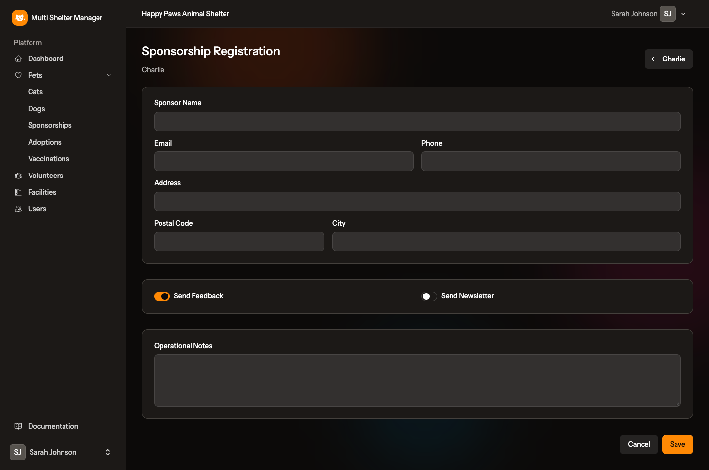
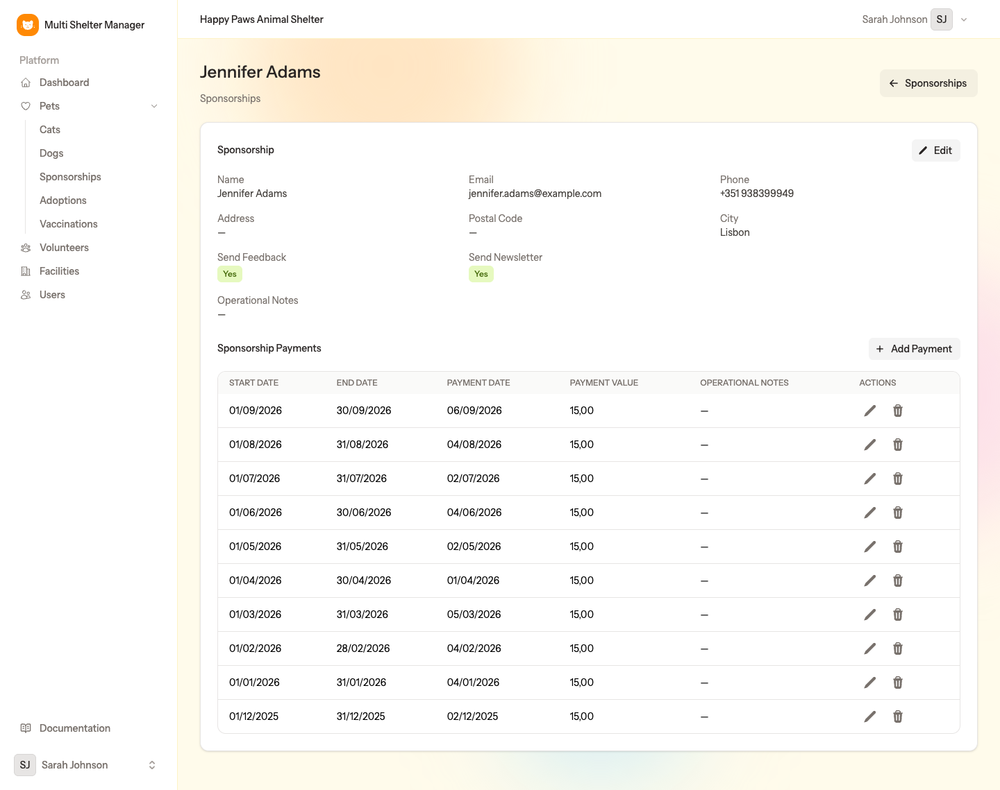
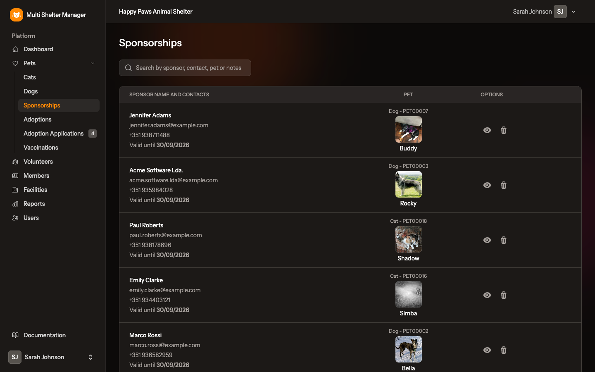

# 10. Sponsorships

[← Adoptions](09-adoptions.md) · [Documentation index](README.md) · [Next: Volunteers →](11-volunteers.md)

> **Who:** Manager and Staff. Viewers cannot open these pages, because they hold personal data.

A sponsor helps pay for an animal's care without adopting it. The application keeps the sponsor's details and every payment they make, whether it is a one-off gift or a monthly contribution.

Only pets with **Is Sponsorable** switched on can be sponsored. A pet can have several sponsors.

## 10.1 Step by step: register a sponsorship

1. Open the pet's record.
2. Click the ❤️ **heart** button and choose **Sponsorship Registration**.
3. Fill in the form:

| Field | Meaning |
|-------|---------|
| **Sponsor Name** | A person or a company |
| **Email**, **Phone**, **Address**, **Postal Code**, **City** | The sponsor's contacts |
| **Send Feedback** | The sponsor wants news and photos of the animal |
| **Send Newsletter** | The sponsor wants the shelter's newsletter |
| **Operational Notes** | Internal notes |

4. Click **Save**.

## 10.2 Recording payments

Open the sponsorship: from **Pets → Sponsorships** (👁 icon) or from the pet's record.

The page shows the sponsor's details and the **Sponsorship Payments** table. To record a payment:

1. Click **Add Payment**.
2. Fill in:
   - **Start Date** and **End Date** — the period the payment covers (for a monthly contribution, the first and last day of the month);
   - **Payment Date** — when the money was received;
   - **Payment Value** — the amount;
   - **Operational Notes** — e.g. the payment method or receipt number.
3. Save.

Use the ✏️ and 🗑 icons on each row to correct or remove a payment. The sponsor's own **Edit** button changes their details.

## 10.3 The Sponsorships page

**Pets → Sponsorships** lists all the shelter's sponsorships with the sponsor's contacts and the sponsored pet.

Use the search box to find a sponsor or a pet.

---

[← Adoptions](09-adoptions.md) · [Documentation index](README.md) · [Next: Volunteers →](11-volunteers.md)
