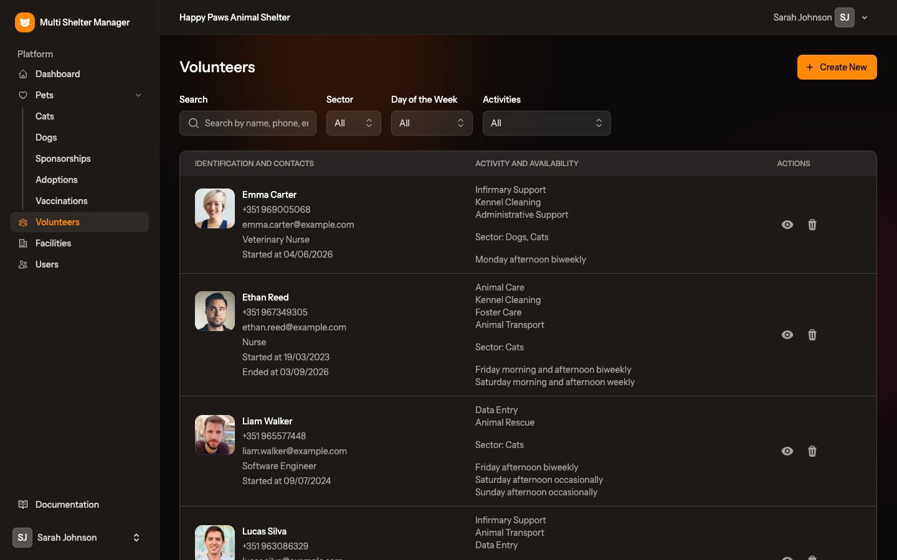
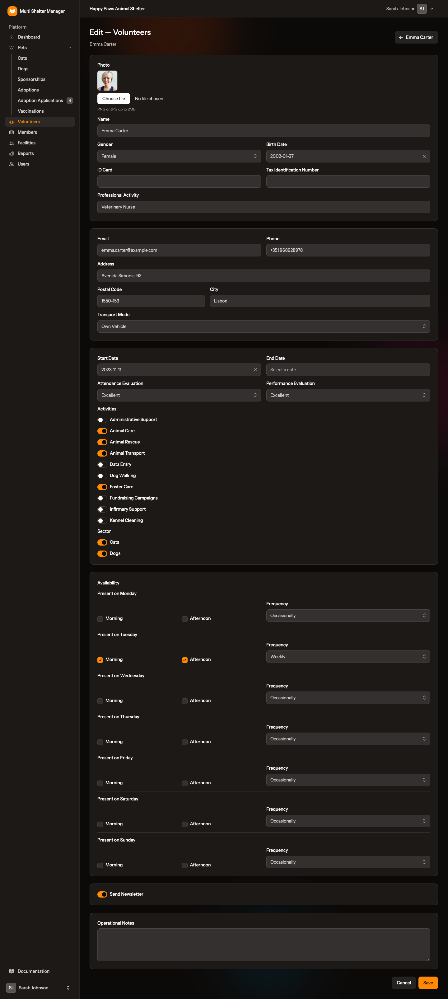
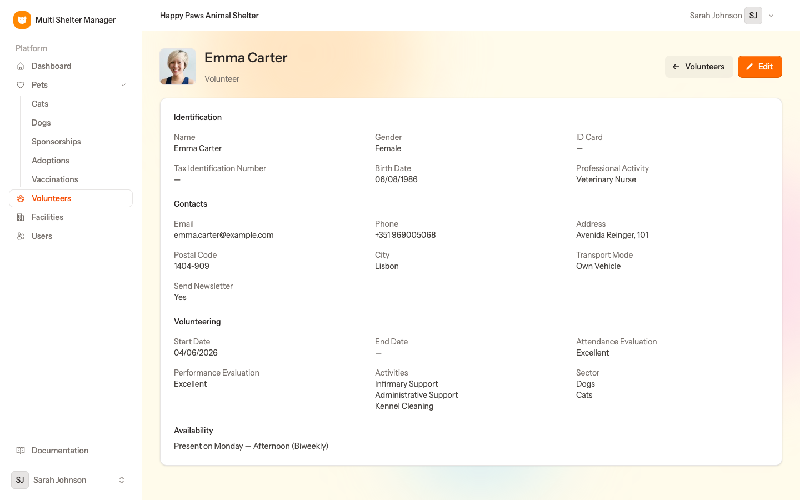

# 11. Volunteers

[← Sponsorships](10-sponsorships.md) · [Documentation index](README.md) · [Next: Members →](12-members.md)

> **Who:** Manager and Staff; only managers can add, edit or delete volunteers. Viewers cannot open these pages, because they hold personal data.

Keep a record of the people who help your shelter: what they do, which animals they prefer, and when they are available. Volunteers are **not** user accounts. They don't log in to the application.

## 11.1 The volunteers list

Open **Volunteers** in the sidebar.

Each row shows the volunteer's photo, name, phone, e-mail, profession and start date (plus end date if they have stopped), and:

- the **activities** they help with;
- the **sector**, meaning the species they work with;
- their **availability**, e.g. *Monday afternoon biweekly*.

Use the filters at the top to find the right person for a task:

| Filter | Use |
|--------|-----|
| **Search** | Name, phone, e-mail, … |
| **Sector** | Volunteers who work with a given species |
| **Day of the Week** | Volunteers available on that day |
| **Activities** | Volunteers who do a given activity |

For example, to find someone to walk dogs on Saturday, choose *Sector: Dogs*, *Day of the Week: Saturday* and *Activities: Dog Walking*.

## 11.2 Step by step: add a volunteer

1. Click **Create New**.
2. Fill in the form, card by card:

**Personal details**

- **Photo** — PNG or JPG up to 2 MB.
- **Name**, **Gender**, **Birth Date**.
- **ID Card** and **Tax Identification Number** — optional, for insurance or official paperwork.
- **Professional Activity** — the volunteer's job. Useful skills (vet nurse, photographer, driver…) are easy to spot here.

**Contacts**

- **Email**, **Phone**, **Address**, **Postal Code**, **City**.
- **Transport Mode** — on foot, bicycle, hitchhiking, public transport or own vehicle. This matters for tasks like animal transport.

**Volunteering**

- **Start Date** and **End Date**. Fill in the end date when someone stops volunteering, to keep the history.
- **Attendance Evaluation** and **Performance Evaluation** — from *Very low* to *Excellent*.
- **Activities** — switch on each task the volunteer helps with. The list is maintained by the admin (see [chapter 3](03-administration.md#38-activities)).
- **Sector** — switch on the species they work with.

**Availability**

For each day of the week, tick **Morning** and/or **Afternoon**, and choose the **Frequency**: *Occasionally*, *Biweekly* or *Weekly*.

**Other**

- **Send Newsletter** — whether they want the shelter's newsletter.
- **Operational Notes** — internal notes.

3. Click **Save**.

## 11.3 The volunteer record

Click 👁 on the list to open the record. **Edit** changes it.

---

[← Sponsorships](10-sponsorships.md) · [Documentation index](README.md) · [Next: Members →](12-members.md)
