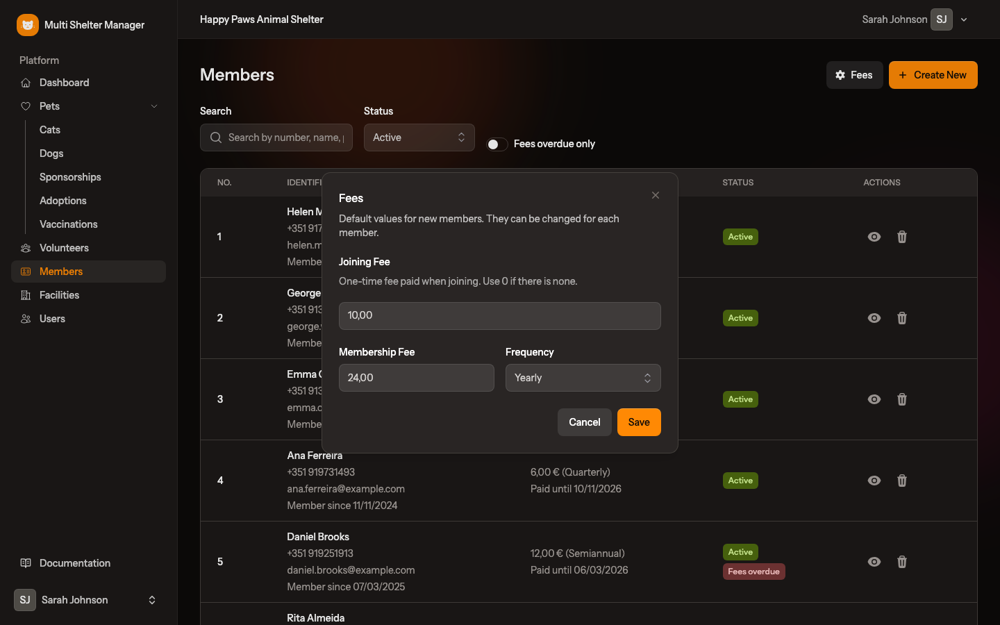
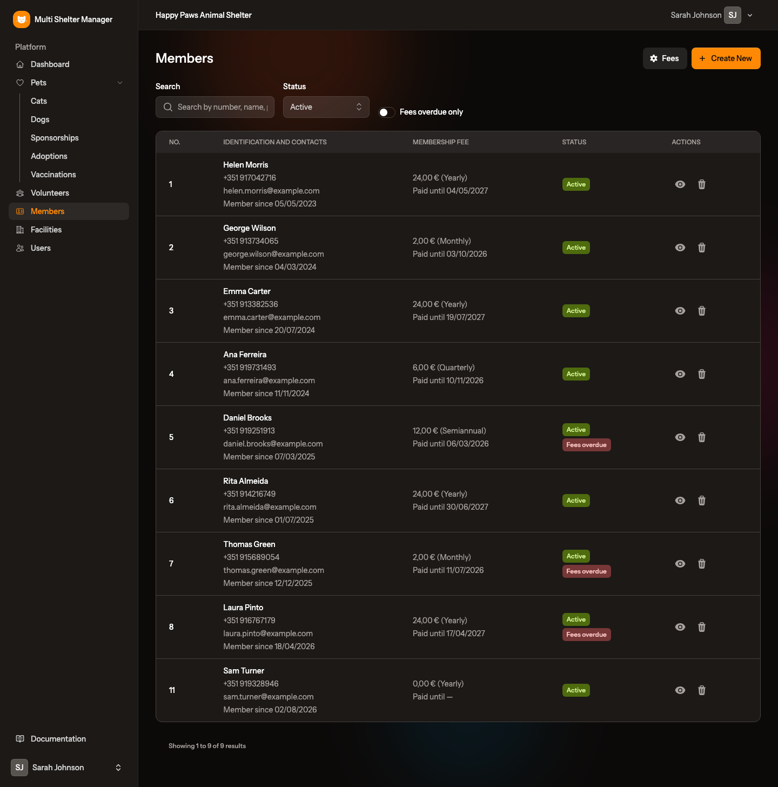
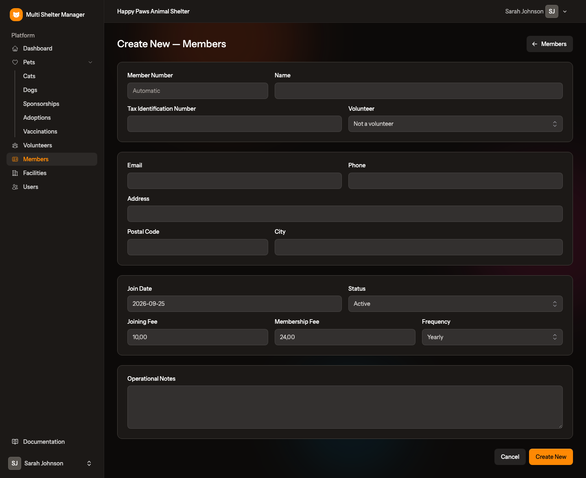
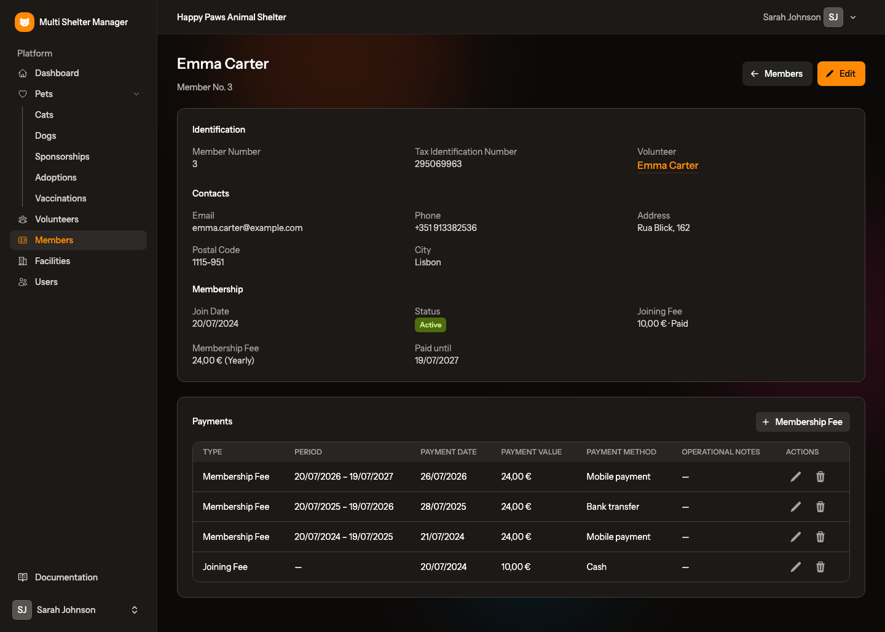

# 12. Members

[← Volunteers](11-volunteers.md) · [Documentation index](README.md) · [Next: The public adoption portal →](13-public-portal.md)

> **Who:** Manager and Staff. Only managers can delete members or change the default fees. Viewers cannot open these pages, because they hold personal data.

Many shelters are run by an association whose members pay a fee. **Members** keeps a record of those people and their payments, and shows at a glance who is behind on their fees.

A member can be linked to their [volunteer](11-volunteers.md) record when they are the same person.

## 12.1 Fees: joining fee and membership fee

Each member has two fees:

| Fee | What it is |
|-----|------------|
| **Joining Fee** | Paid **once**, when the person joins. It can be **0**, in which case nothing is owed. |
| **Membership Fee** | The recurring fee, paid **Monthly**, **Quarterly**, **Semiannual** or **Yearly**. |

### Step by step: set the shelter's default fees (managers)

1. Open **Members** in the sidebar.
2. Click **Fees** at the top of the list.
3. Fill in the **Joining Fee** (use 0 if there is none), the **Membership Fee** and its **Frequency**.
4. Click **Save**.

New members start with these values. They can then be changed for each member, for example for a member who is exempt from the joining fee.

## 12.2 The members list

Each row shows the **member number**, the name, phone, e-mail and join date, the membership fee and how long it is **paid until**, and the member's **status**. A red **Fees overdue** badge marks members who owe money (see [12.5](#125-fees-overdue)).

| Filter | Use |
|--------|-----|
| **Search** | Member number, name, phone, e-mail, tax number or notes |
| **Status** | *Active* (the default), *Suspended*, *Former member* or *All* |
| **Fees overdue only** | Only the members who owe the joining fee or a membership fee |

## 12.3 Step by step: add a member

1. Click **Create New**.
2. Fill in the form:
   - **Member Number** — leave it empty and the next number is assigned automatically, or type one to keep the numbering your association already uses. A number can only be used once per shelter, and the numbers of deleted members are never reused.
   - **Name**, **Tax Identification Number** and, optionally, the **Volunteer** record of the same person.
   - **Email**, **Phone**, **Address**, **Postal Code**, **City**.
   - **Join Date** (today by default) and **Status**.
   - **Joining Fee**, **Membership Fee** and **Frequency**, pre-filled with the shelter's defaults.
   - **Notes**.
3. Click **Create New**.

## 12.4 The member record and payments

Click 👁 on the list (or the member's name) to open the record. It shows the member's details, whether the joining fee is paid, the **Paid until** date and the payment history. **Edit** changes the member's details.

### Step by step: record a payment

1. On the member's record, click **+ Membership Fee** (or **+ Joining Fee**, shown only while the joining fee is owed).
2. The form is pre-filled:
   - a membership fee covers the **next period to pay**, from the day after the last paid period (or from the join date for the first one), for one month, quarter, half-year or year depending on the frequency, with the member's fee as the amount;
   - a joining fee has no period and uses the member's joining fee as the amount.
3. Check the **Payment Date** and **Payment Value**, choose the **Payment Method** (*Cash*, *Bank transfer*, *Mobile payment* or *Other*) and add notes if needed.
4. Click **Create New**.

Use ✏️ and 🗑 in the payments table to correct or delete a payment.

## 12.5 Fees overdue

An **active** member is marked **Fees overdue** when:

- their joining fee is above 0 and has not been paid, **or**
- their membership fee is above 0 and no payment covers today.

The badge disappears as soon as the missing payment is recorded. Switch on **Fees overdue only** on the list to see who needs a reminder.

## 12.6 Status is set by hand

The status (**Active**, **Suspended** or **Former member**) never changes automatically, not even when fees are overdue. Suspending or removing a member is usually a decision taken under the association's own rules, so change it in the member's form when that decision is made. Suspended and former members are never marked as overdue.

## 12.7 Deleting a member

Managers can delete a member with the 🗑 icon on the list. Keep former members with the *Former member* status instead, so their payment history is preserved.

---

[← Volunteers](11-volunteers.md) · [Documentation index](README.md) · [Next: The public adoption portal →](13-public-portal.md)
