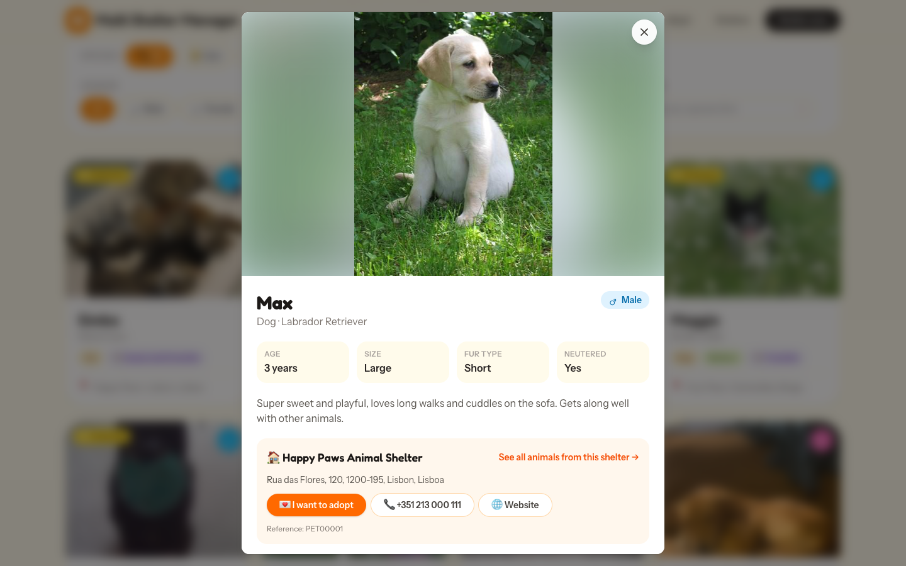
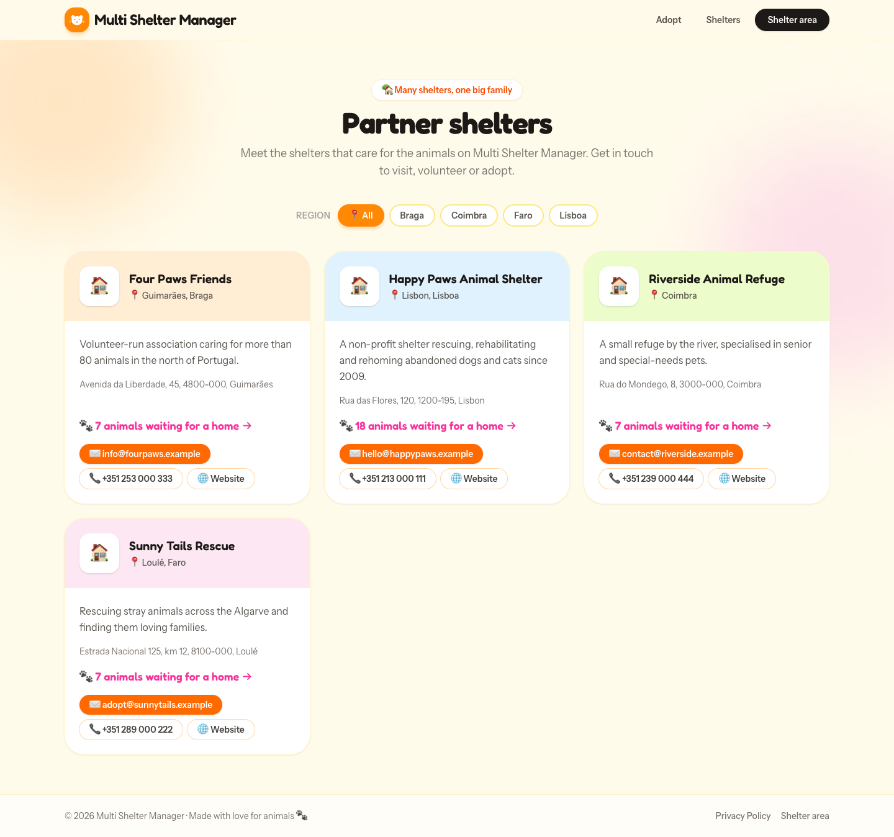
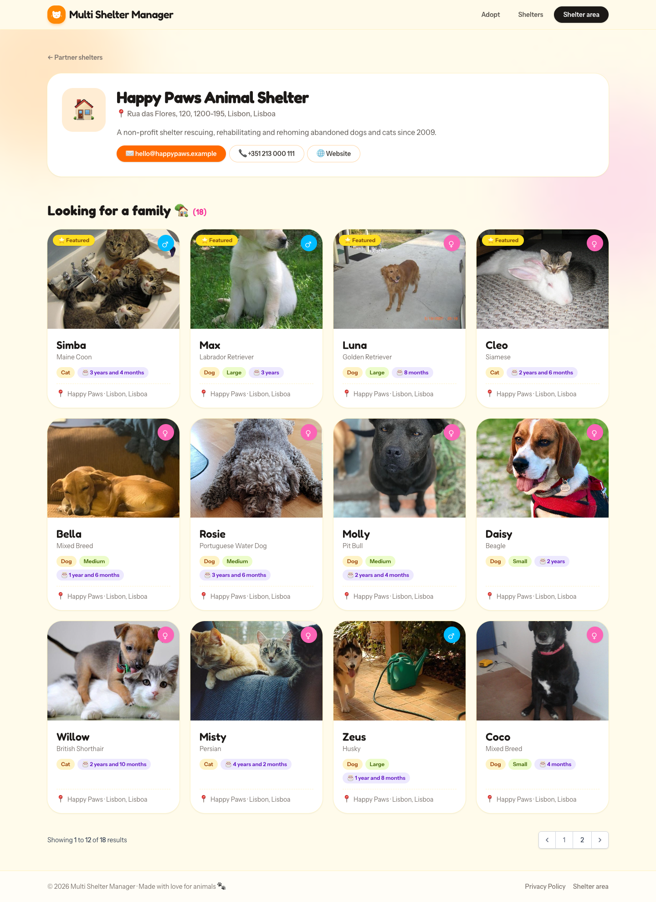

# 12. The public adoption portal

[← Volunteers](11-volunteers.md) · [Documentation index](README.md) · [Next: Personal settings →](13-settings.md)

> **Who:** Anyone, no login needed.

The public portal is a website where anyone can browse the animals waiting for a home in **all** the shelters on the platform, and contact the shelter to adopt.

## 12.0 Turning the portal on

The portal is **off by default**. While it is off, the home page, the **Shelters** pages and the animal pages are not available: visitors are sent straight to the login page, and the application works as a back-office only.

To turn it on:

1. Open the `.env` file at the root of the project.
2. Set:

   ```dotenv
   PUBLIC_PORTAL_ENABLED=true
   ```

3. If the configuration is cached (usual in production), refresh it:

   ```bash
   php artisan config:cache
   ```

4. Open the application's root address (e.g. `https://your-domain.org/`). The portal home page appears.

To turn it off again, set `PUBLIC_PORTAL_ENABLED=false` and repeat step 3.

> The **Privacy Policy** page is always available, whether the portal is on or off. Set its contact e-mail with `PRIVACY_CONTACT_EMAIL` (see the [environment variables reference](01-installation.md#multi-shelter-manager-settings)).

## 12.1 Home page

The home page is at the root address of the application (e.g. `https://your-domain.org/`).


It shows:

- a welcome section with the number of **partner shelters**, **animals waiting for a home** and **regions covered**;
- a short **How it works** section;
- **Looking for a family**: the animals available for adoption, with filters by **species**, **gender**, **region**, **size** and **breed**. *Featured* animals are shown first.

The **Shelter area** button (top right) takes the shelter team to the login page.

## 12.2 Animal details

Click an animal's card to open its details: photo, species and breed, age, size, fur type, whether it is neutered, and its description. It also shows the shelter's contacts, an **I want to adopt** button, and a link to **see all animals from this shelter**.



Every time the details are opened, the animal's **View Count** goes up. The team can see it on the pet's record.

## 12.3 Partner shelters

The **Shelters** menu lists every shelter on the platform, filterable by **region**, with its description, address, contacts, and how many animals it has waiting for a home.



Click a shelter to see its own page, with only its animals:



## 12.4 Which animals appear on the portal?

An animal appears on the portal only when **all** of these are true:

- **Publish to Public Portal** is switched on;
- **Is Adoptable** is switched on;
- its status is **Available** (not adopted and not deceased).

To remove an animal from the portal, switch off **Publish to Public Portal** on its record. To show it first, switch on **Featured**.

## 12.5 Privacy policy

The portal footer links to a **Privacy Policy** page, available in every supported language.

---

[← Volunteers](11-volunteers.md) · [Documentation index](README.md) · [Next: Personal settings →](13-settings.md)
