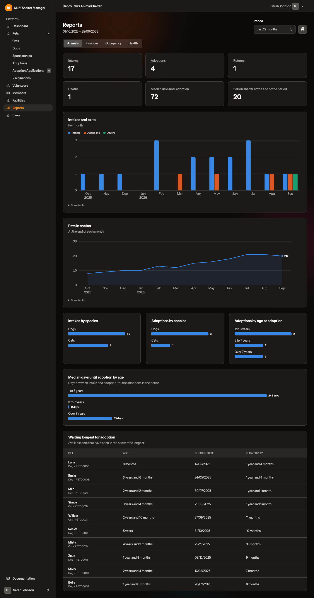
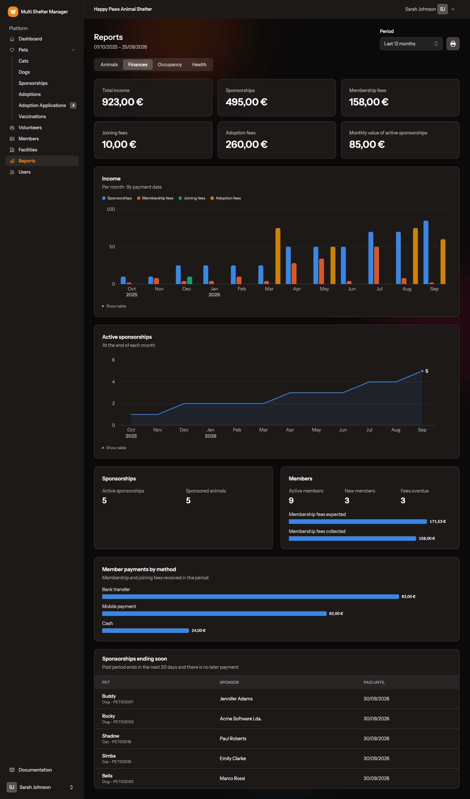
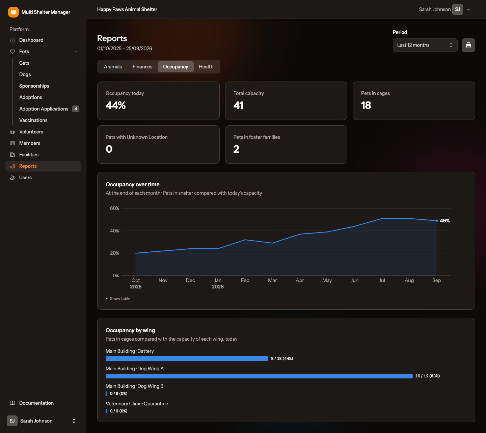
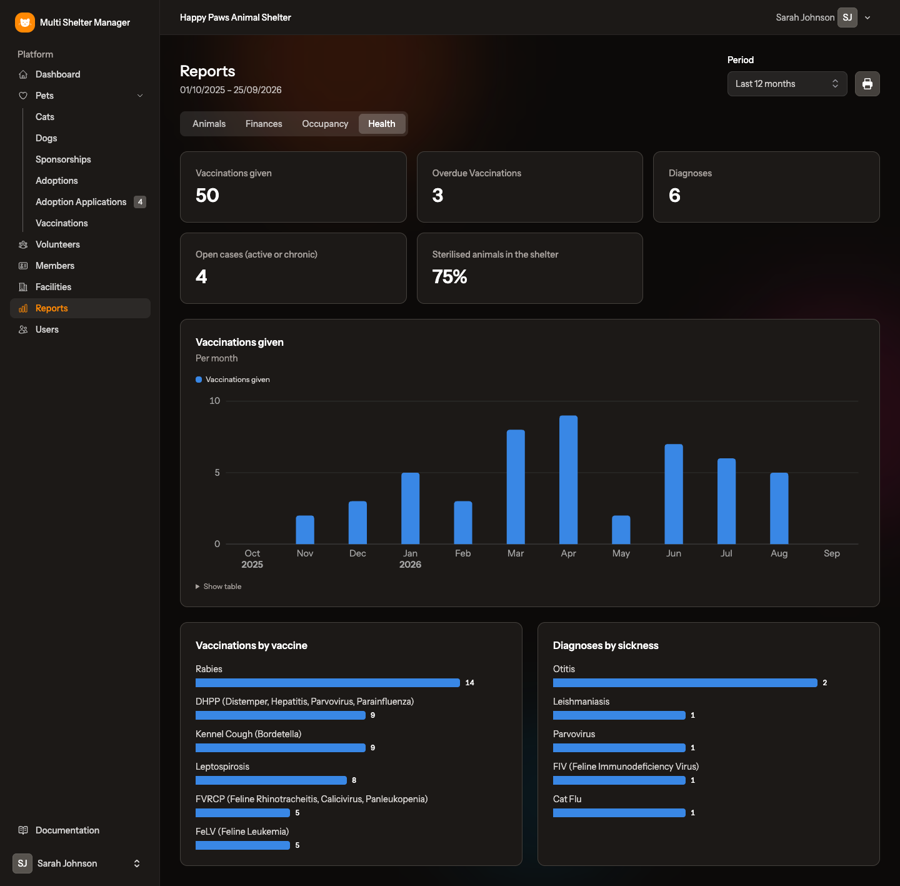
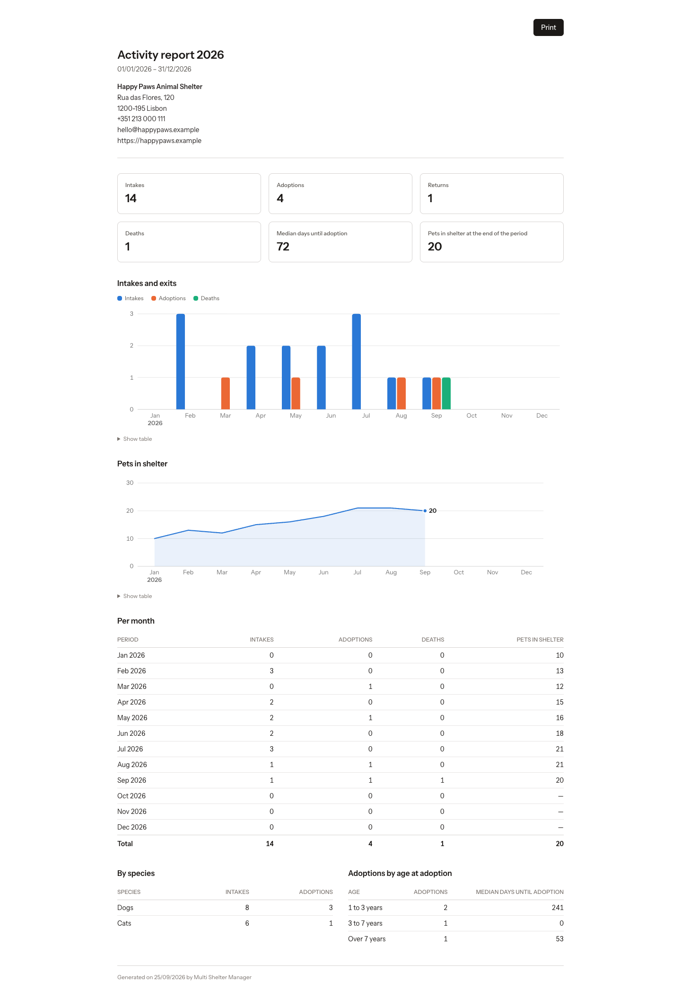

# 13. Reports

[← Members](12-members.md) · [Documentation index](README.md) · [Next: The public adoption portal →](14-public-portal.md)

> **Who:** Managers only. Staff, viewers and admins do not see Reports.

Reports turn the shelter's records into the numbers a board, a general assembly or a funding application asks for: how many animals came in and left, how long they waited, where the money came from and how full the shelter is.

Open **Reports** in the sidebar.

## 13.1 Choosing the period

The **Period** selector (top right) applies to every tab:

- **Last 12 months** (the default);
- a single **year**, for example 2025, which is the one to use for the yearly activity report;
- **All time**;
- **Custom**, to type your own start and end dates.

Periods of two years or more are shown **per year** instead of per month.

Every chart shows its values when you hover over it, and **Show table** below it lists the same numbers as a table.

## 13.2 Animals

- **Summary** — intakes, adoptions, returns and deaths in the period, the median number of days until adoption, and the animals in the shelter at the end of the period.
- **Intakes and exits** — per month (or year): intakes, adoptions and deaths side by side.
- **Pets in shelter** — how many animals were in the shelter at the end of each month.
- **Intakes by species**, **Adoptions by species** and **Adoptions by age at adoption**.
- **Median days until adoption by age** — how long animals of each age group waited between intake and adoption. Useful to see which animals need more help to find a home.
- **Waiting longest for adoption** — the available animals that have been in the shelter the longest.

## 13.3 Finances

Income is counted by **payment date**, so it matches the bank statement.

- **Summary** — total income, sponsorships, membership fees, joining fees, adoption fees, and the monthly value of the active sponsorships.
- **Income** — per month and by source.
- **Active sponsorships** — how many sponsorships had a paid period covering the end of each month.
- **Sponsorships** and **Members** — active sponsorships and sponsored animals; active, new and overdue members, and the membership fees expected in the period compared with those collected.
- **Member payments by method** — cash, bank transfer, mobile payment or other.
- **Sponsorships ending soon** — sponsorships whose paid period ends in the next 30 days with no later payment, so you can contact the sponsor in time.

> Expenses are not recorded in the application, so this is an income report, not a full set of accounts.

## 13.4 Occupancy

- **Occupancy today**, **total capacity**, **pets in cages**, **pets with unknown location** and **pets in foster families**.
- **Occupancy over time** — the animals in the shelter compared with today's capacity (capacity has no history, so past months use today's value).
- **Occupancy by wing** — for example *11 / 12 (92%)*.

Cage capacity is only a guideline, so the reports never warn about a shelter being "over capacity". [Foster family](05-facilities.md#57-foster-families) wings are not counted as shelter space.

## 13.5 Health

- **Vaccinations given** — per month and by vaccine.
- **Overdue vaccinations** — links to the vaccinations list, filtered.
- **Diagnoses** by sickness and **open cases** (active or chronic).
- **Sterilised animals in the shelter** — the share of animals in the shelter today that are neutered or spayed.

## 13.6 Printing a report

The 🖨 button (next to the period) opens the tab you are looking at as a printable report, with the shelter's name, address, contacts and logo, the period, and a *Generated on* date. With a single year selected, the Animals tab becomes the **Activity report** of that year, ready for the general assembly.

Click **Print**, or save it as PDF from the browser's print window. Printouts are always white, even if you use dark mode, and charts are never split across pages.

---

[← Members](12-members.md) · [Documentation index](README.md) · [Next: The public adoption portal →](14-public-portal.md)
