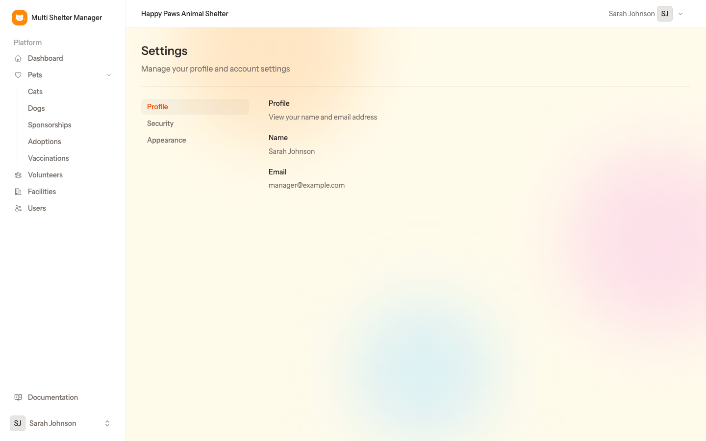
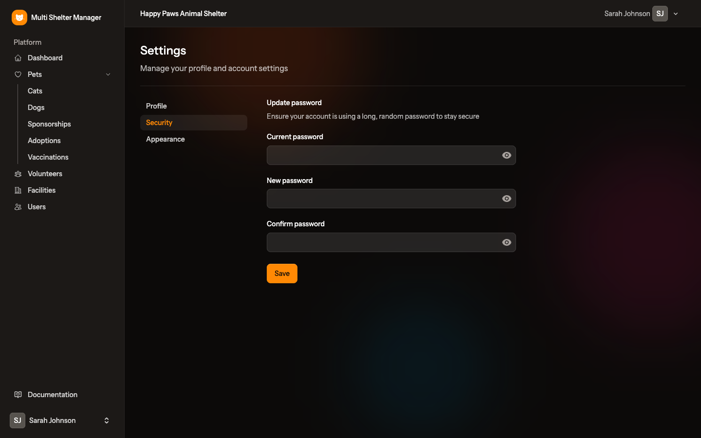
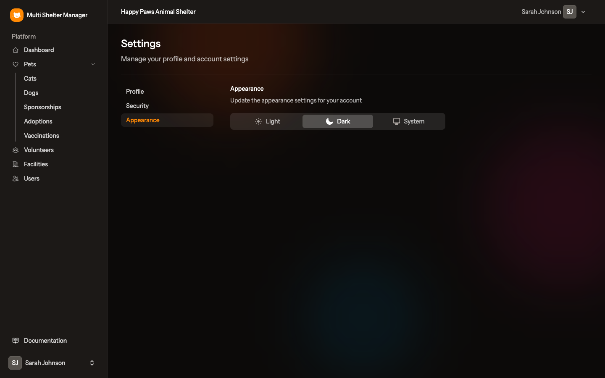

# 14. Personal settings

[← The public adoption portal](13-public-portal.md) · [Documentation index](README.md)

> **Who:** Everyone.

Open the user menu (your name at the bottom of the sidebar) and choose **Settings**. There are three tabs.

## 14.1 Profile

Shows your **Name** and **Email**.

- Your **name** can only be changed by an admin or by your shelter's manager (**Users → Edit**).
- Your **e-mail** cannot be changed, because it identifies your account.

## 14.2 Security

Change your password. For your protection, the application first asks you to type your current password again.

1. Type your **Current password**.
2. Type the **New password** and repeat it in **Confirm password**.
3. Click **Save**.

## 14.3 Appearance

Choose how the application looks on this device: **Light**, **Dark**, or **System** (follows your computer's or phone's setting).

## 14.4 Language

The interface language is set for the whole installation by the `APP_LOCALE` setting (see [Installation](01-installation.md#application-name-url-and-language)). English, Portuguese, Spanish, French, German, Italian, Dutch, Polish, Swedish and Danish are available.

---

[← The public adoption portal](13-public-portal.md) · [Documentation index](README.md)
