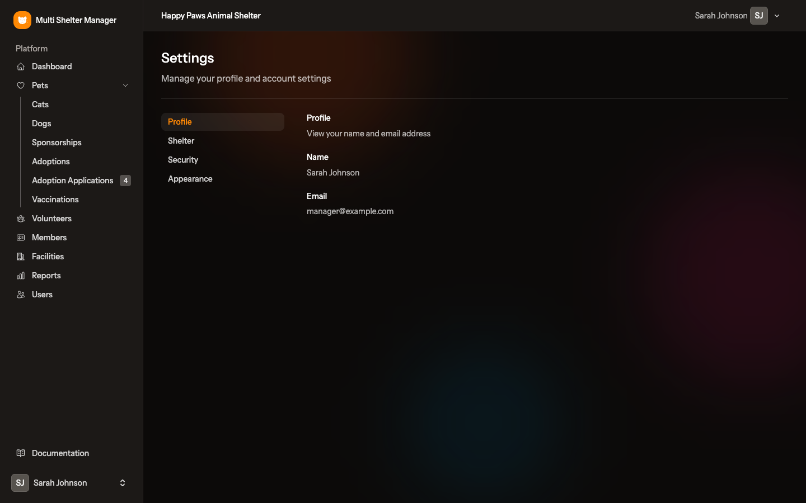
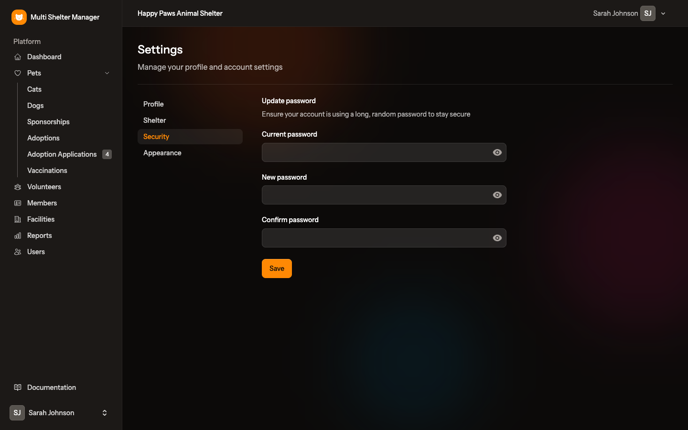
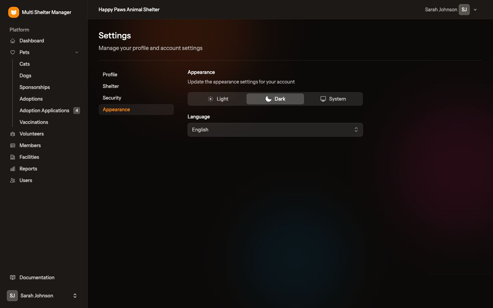
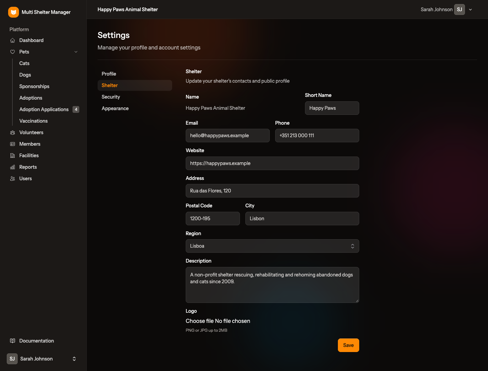

# 15. Personal settings

[← The public adoption portal](14-public-portal.md) · [Documentation index](README.md)

> **Who:** Everyone. The **Shelter** tab is for managers only.

Open the user menu (your name at the bottom of the sidebar) and choose **Settings**. There are three tabs: **Profile**, **Security** and **Appearance**. Managers also see a **Shelter** tab (see [15.5](#155-shelter-managers-only)).

## 15.1 Profile

Shows your **Name** and **Email**.

- Your **name** can only be changed by an admin or by your shelter's manager (**Users → Edit**).
- Your **e-mail** cannot be changed, because it identifies your account.

## 15.2 Security

Change your password. For your protection, the application first asks you to type your current password again.

1. Type your **Current password**.
2. Type the **New password** and repeat it in **Confirm password**.
3. Click **Save**.

## 15.3 Appearance

Choose how the application looks on this device: **Light**, **Dark**, or **System** (follows your computer's or phone's setting). This page also has the **Language** setting (see below).

## 15.4 Language

Each user chooses their own language in **Settings → Appearance → Language**. The page reloads in the new language straight away.

- The choice is saved to your account, so it follows you to other computers and phones.
- The e-mails you receive (invitations, vaccination reminders, adoption applications) are also sent in your language.
- Until you choose one, you see the installation's default language, set by `APP_LOCALE` (see [Installation](01-installation.md#application-name-url-and-language)). The application does not guess the language from your browser.

On the public pages and the login page, a language menu at the top (e.g. **PT**) lets anyone switch without logging in. If you are logged in, switching there also saves it to your account.

English, Portuguese, Spanish, French, German, Italian, Dutch, Polish, Swedish and Danish are available.

## 15.5 Shelter (managers only)

The manager keeps the profile of the **active shelter** up to date. These details appear on printed pet sheets, in the text for sharing a pet and, when the public portal is on, on the shelter's public page and in search engine results.

| Field | Meaning |
|-------|---------|
| Name | Shown only. Ask an admin if it needs to change |
| Short Name | Short name used where space is limited (lists, cards, badges) |
| Public address | Read-only, with a copy button: the shelter's page on the public portal, to share on social media, posters and e-mails. Only the administrator can change it (see [Administration](03-administration.md)). Shown only when the public portal is enabled |
| Email | **Required.** The shelter's public contact e-mail |
| Phone, Website | Public contacts |
| Address, Postal Code, City | Location of the shelter. City is required |
| Region | One of the regions set up by the admin |
| Description | Short presentation, shown on the public portal |
| Logo | PNG or JPG image up to 2 MB. Choosing a new one replaces the old one |

Click **Save**.

The shelter's **name** and its **species** (which species appear under **Pets**) can only be changed by an admin (see [Shelters](03-administration.md#39-shelters)). Staff and viewers do not see this tab.

---

[← The public adoption portal](14-public-portal.md) · [Documentation index](README.md)
