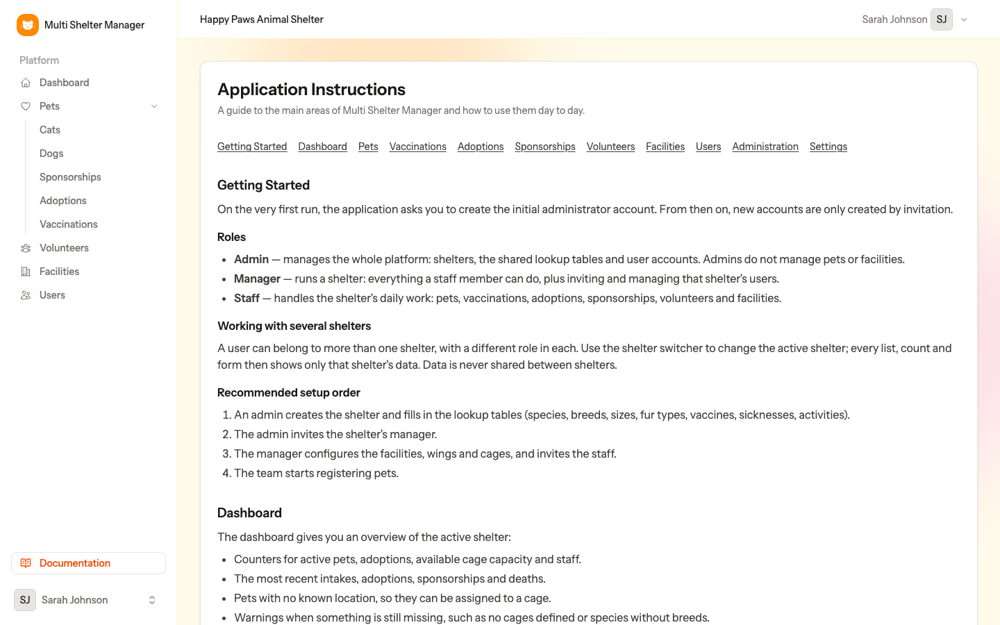

# Multi Shelter Manager — Documentation

Welcome! This guide explains **everything from step 1**: installing the application, creating the first administrator, preparing the platform, and running an animal shelter day to day.

Read the chapters in order the first time. Each one builds on the previous.

| # | Chapter | Who it is for |
|---|---------|---------------|
| 1 | [Installation](01-installation.md) | Whoever installs the application (IT / developer) |
| 2 | [First run, login and roles](02-first-run-and-roles.md) | Everyone |
| 3 | [Administration: shelters and lookup tables](03-administration.md) | Admin |
| 4 | [Inviting users](04-users-and-invitations.md) | Admin, Manager |
| 5 | [Facilities, wings and cages](05-facilities.md) | Manager, Staff |
| 6 | [The dashboard](06-dashboard.md) | Manager, Staff |
| 7 | [Pets](07-pets.md) | Manager, Staff |
| 8 | [Vaccinations](08-vaccinations.md) | Manager, Staff |
| 9 | [Adoptions](09-adoptions.md) | Manager, Staff |
| 10 | [Sponsorships](10-sponsorships.md) | Manager, Staff |
| 11 | [Volunteers](11-volunteers.md) | Manager, Staff |
| 12 | [The public adoption portal](12-public-portal.md) | Everyone |
| 13 | [Personal settings](13-settings.md) | Everyone |

## The big picture

Multi Shelter Manager is a web application that lets **several animal shelters** work on the same platform, each one completely isolated from the others. A shelter only ever sees its own animals, facilities, volunteers and records.

```
Platform (Admin)
 ├── Lookup tables shared by every shelter
 │     species · breeds · sizes · fur types · vaccines · sicknesses · activities · regions
 └── Shelters
       ├── Users (Managers and Staff)
       ├── Facilities ─► Wings ─► Cages ─► Pets
       ├── Pets ─► photos · vaccinations · sicknesses · adoptions · sponsorships
       └── Volunteers
```

There are three roles:

| Role | What they do |
|------|--------------|
| **Admin** | Runs the platform: creates shelters, maintains the shared lookup tables, invites users. Does **not** manage pets or facilities. |
| **Manager** | Runs one (or more) shelters: everything Staff can do, plus inviting and managing that shelter's users. |
| **Staff** | Does the daily work of a shelter: pets, vaccinations, adoptions, sponsorships, volunteers and facilities. |

## The recommended order to get started

1. **Install** the application ([chapter 1](01-installation.md)).
2. **Create the administrator** in the setup wizard ([chapter 2](02-first-run-and-roles.md)).
3. The admin **creates the shelters** and fills in the **lookup tables** ([chapter 3](03-administration.md)).
4. The admin **invites each shelter's manager** ([chapter 4](04-users-and-invitations.md)).
5. The manager **builds the facilities, wings and cages** ([chapter 5](05-facilities.md)) and invites the staff.
6. The team **registers the pets** ([chapter 7](07-pets.md)) and starts recording vaccinations, adoptions, sponsorships and volunteers.

> **Tip:** The same guide, in short form, is available inside the application under **Documentation** in the sidebar, in every supported language.
>
> 
